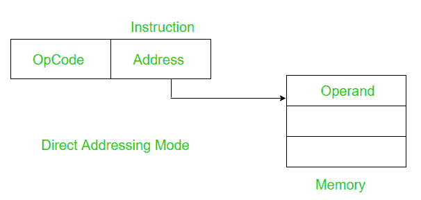

# 直接寻址模式和隐含寻址模式的区别

> 原文:[https://www . geesforgeks . org/直接寻址和隐含寻址模式的区别/](https://www.geeksforgeeks.org/difference-between-direct-and-implied-addressing-modes/)

先决条件–[寻址模式](https://www.geeksforgeeks.org/addressing-modes/)

**1。直接寻址模式:**
在直接寻址模式下，地址字段包含操作数的地址。



```
Effective Address(EA) = address field of operand 
```

*示例–*
将寄存器 A 的内容添加到累加器中。

```
ADD A 
```

在内存中的地址 A 中查找操作数。访问数据只需要一个内存引用。因此，不需要额外的计算来计算有效地址。

**2。隐含寻址模式:**
操作数在指令定义中隐含指定。它通常用于零地址或单地址指令。

*例-1:*
增加寄存器 a 的内容

```
INC A 
```

这里隐含地规定寄存器 A 既是源也是目的地。

*示例-2:*
清除标志寄存器的内容。

```
CLC 
```

上述指令是零地址指令的一个例子。

**直接和隐含寻址模式的区别:**

<center>

| 直接寻址模式 | 隐含寻址模式 |
| --- | --- |
| 地址字段包含操作数的有效地址。 | 操作数的有效地址是隐式指定的。 |
| 指令大小较大，因为必须明确指定操作数。 | 指令大小较小，因为操作数是隐式指定的。 |
| 它需要一个内存引用。 | 不需要内存引用。 |
| 主要用于 2 个地址指令及更多。 | 多用于零地址和单地址指令。 |
| 它比隐含模式慢。 | 这是一个更快的方法。 |
| 它比隐含模式有更大的范围。 | 它的范围比直接模式小。 |

</center>