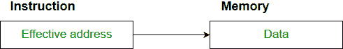

# 直接和间接寻址模式的区别

> 原文:[https://www . geesforgeks . org/直接和间接寻址模式的区别/](https://www.geeksforgeeks.org/difference-between-direct-and-indirect-addressing-modes/)

先决条件:[寻址模式](https://www.geeksforgeeks.org/addressing-modes/)

**1。直接寻址模式:**
在直接寻址模式下，指令中的地址字段包含操作数的有效地址，不需要中间存储器访问。现在一天很少用了。



**例:**
添加 R1 和 1001 的内容，存储回 R1:

```
Add R1, (1001) 
```

这里 1001 是存储操作数的地址。

**2。间接寻址模式:**
在间接寻址模式下，指令中的地址字段包含操作数有效地址所在的存储单元或寄存器。它需要两次内存访问。它进一步分为两类:间接语域和间接记忆。

**示例:**

```
LOAD R1, @500
```

上述指令用于加载存储在存储单元 500 中的存储单元的内容，以注册 R1。换句话说，我们可以说，有效地址存储在存储单元 500 中。

**直接和间接寻址模式的区别:**

| S.NO | 直接寻址模式 | 间接寻址模式 |
| 1. | 地址字段包含操作数的有效地址 | 地址字段包含有效地址的引用 |
| 2. | 只需要一个内存引用 | 需要两个内存引用 |
| 3. | 快速寻址 | 比直接寻址模式慢 |
| 4. | 没有进一步分类 | 进一步分为两类 |
| 5. | 执行该操作不需要进一步计算 | 需要进一步计算才能找到有效地址 |