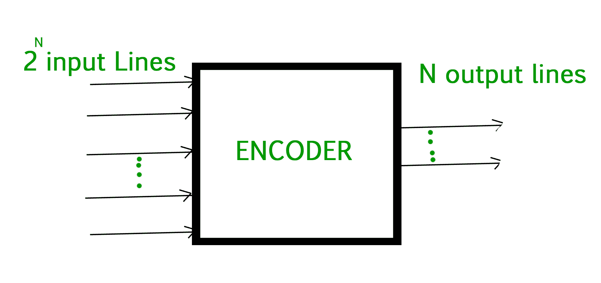
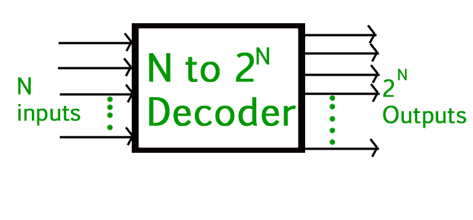

# 编码器和解码器的区别

> 原文:[https://www . geesforgeks . org/编码器和解码器之间的差异/](https://www.geeksforgeeks.org/difference-between-encoder-and-decoder/)

**组合逻辑**是两个或多个输入状态定义一个或多个输出状态的概念。**编码器和解码器**是组合逻辑电路。其中我们借助布尔代数实现了组合逻辑。

编码是将一段明确的信息转换成一种不太清楚的代码形式，执行这种操作的设备被称为 ad Encoder。

**1。** [**编码器**](https://www.geeksforgeeks.org/encoder-in-digital-logic/) **:**
编码器是将活动数据信号转换为编码消息格式的设备，或者是将模拟信号转换为数字信号的设备。它是一个组合电路，将 2N 条输入线形式的二进制信息转换成 N 条输出线，代表输入的 N 位代码。当一个输入信号被施加到编码器时，编码器中的逻辑电路将该特定输入转换成编码的二进制输出。

解码是执行相反的操作:将代码转换回明确的形式代码，执行此操作的设备称为解码器。

**2。** [**解码器**](https://www.geeksforgeeks.org/binary-decoder-in-digital-logic/) **:**
解码器也是作为编码器的组合电路，但其操作与编码器完全相反。解码器是一种从编码输入信号生成原始信号作为输出，并将 n 行输入转换为 2n 行输出的设备。与门可以用作基本解码元件，因为只有当所有输入都为高电平时，它才会产生高输出。

**编码器和解码器的区别:**

<figure class="table">

| 没有。 | 编码器 | 解码器 |
| one | 编码器电路基本上将施加的信息信号转换成编码的数字比特流。 | 解码器执行反向操作，并从编码位恢复原始信息信号。 |
| Two | 在编码器的情况下，施加的信号是有效信号输入。 | 解码器接受编码的二进制数据作为其输入。 |
| three | 编码器接受的输入数量为 2n。 | 解码器接受的输入数量只有 n 个输入。 |
| four | 编码器的输出线为 n。 | 解码器的输出线是 2n。 |
| five | 编码器产生编码数据位作为其输出。 | 解码器响应编码的数据位产生有效输出信号。 |
| six | 操作简单。 | 执行的操作很复杂。 |
| seven | 编码器电路安装在发射端。 | 解码器电路安装在接收侧。 |
| eight | 或门是其中使用的基本逻辑元件。 | 与门和非门是其中使用的基本逻辑元件。 |
| nine | 它用于电子邮件、视频编码器等。 | 它用于微处理器、存储芯片等。 |

</figure>