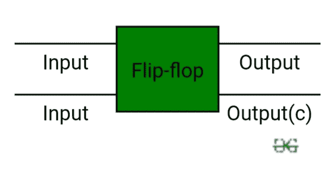
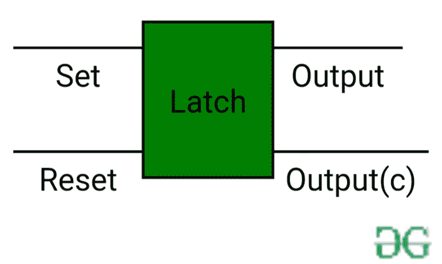

# 触发器和锁存器之间的差异

> 原文:[https://www . geeksforgeeks . org/触发器和锁存器之间的差异/](https://www.geeksforgeeks.org/difference-between-flip-flop-and-latch/)

**[触发器](https://www.geeksforgeeks.org/flip-flop-types-and-their-conversion/) :**
触发器是一种基本的数字存储电路，存储一位信息。触发器是大多数时序电路的基本模块。它也被称为双稳态多谐振荡器或二进制或一位存储器。触发器在时序电路中用作存储元件。

输出在时序电路中从组合电路或触发器或两者获得。触发器的状态在时钟脉冲激活时发生变化，并且在时钟脉冲不激活时不受影响。特别地，时钟触发器用作同步时序电路中的存储元件，而非时钟触发器(即锁存器)用作异步时序电路中的存储元件。

**[闩锁](https://www.geeksforgeeks.org/latches-in-digital-logic/) :**
闩锁是一种电子设备，它根据施加的输入立即改变其输出。它用于在任何指定时间存储 1 或 0。它由两个输入即“设置”和“复位”以及两个相互补充的输出组成。

**触发器和锁存器的区别:**

| SNO | 触发器 | 门闩 |
| one | 触发器是一种双稳态器件，即它有两种稳定状态，分别表示为 0 和 1。 | 锁存器也是双稳态器件，其状态也表示为 0 和 1。 |
| Two | 它检查输入，但仅在时钟信号或任何其他控制信号定义的时间改变输出。 | 它持续检查输入，并立即对输入的变化做出响应。 |
| three | 这是一个边缘触发设备。 | 这是一个水平触发装置。 |
| four | 或非门、非门、与门、与非门都是触发器的组成部分。 | 这些也是由门组成的。 |
| five | 它们分为异步或同步触发器。 | 闩锁中没有这样的分类。 |
| six | 它构成了许多时序电路的组成部分，如计数器。 | 这些可以用于时序电路的设计，但通常不是优选的。 |
| seven | 触发器总是有时钟信号 | 锁没有时钟信号 |
| eight | 触发器可以由锁存器构成 | 锁存器可以由门构成 |
| nine | 前:D 触发器，JK 触发器 | 例如:SR 锁存、D 锁存 |

