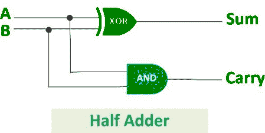
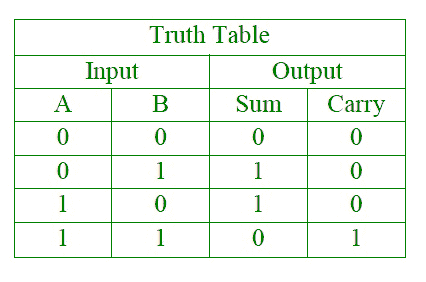
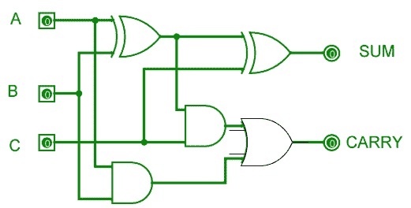
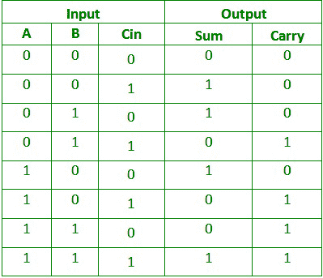

# 半加法器和全加器的区别

> 原文:[https://www . geesforgeks . org/半加法器和全加器之差/](https://www.geeksforgeeks.org/difference-between-half-adder-and-full-adder/)

**1。[半加法器](https://www.geeksforgeeks.org/half-adder-in-digital-logic/) :**
半加法器是由一个 EX-OR 门和一个 and 门连接而成的组合逻辑电路。半加法器电路有两个输入端:A 和 B，它们相加两个输入数字，并产生一个进位和一个和。



异或门的输出是两个数的和，与门的输出是进位。将不会有进位加法的转发，因为没有逻辑门来处理它。因此，这被称为半加法器电路。

**逻辑表达式:**

```
Sum = A XOR B
Carry = A AND B 

```

**真值表:**



**2。[全加器](https://www.geeksforgeeks.org/full-adder-in-digital-logic/) :**
全加器是由两个异或门、两个与门和一个或门组成的电路。全加器是将三个输入相加并产生两个输出的加法器，由两个异或门、两个与门和一个或门组成。前两个输入是 A 和 B，第三个输入是作为 C-IN 的输入进位。输出进位被指定为 C-OUT，正常输出被指定为 S，即 SUM。



EX-OR 门得到的方程是二进制数的和。而与门得到的输出是加法得到的进位。

**真值表:**



**逻辑表达式:**

```
SUM = (A XOR B) XOR Cin = (A ⊕ B) ⊕ Cin
CARRY-OUT = A AND B OR Cin(A XOR B) = A.B + Cin(A ⊕ B) 

```

**半加法器和全加器的区别:**

<center>

| 没有。 | 半加器 | 全加器 |
| one | 半加法器是将两个 1 位数字相加的组合逻辑电路。半加法器产生两个输入的和。 | 全加器是对三个一位二进制数执行加法运算的组合逻辑电路。全加器产生三个输入和进位值的总和。 |
| Two | 不使用以前的进位。 | 使用前一进位。 |
| three | 在半加法器中有两个输入位(A，B)。 | 全加器有三个输入位(A，B，C-in)。 |
| four | 半加法器的逻辑表达式为:
s=a⊕b；C=a*b。 | 全加器的逻辑表达式为:
s=a⊕b⊕cin；Cout=(a*b)+(Cin*(a⊕b)). |
| five | 它由一个异或门和一个与门组成。 | 它由两个异或门、两个与门和一个或门组成。 |
| six | 它用于计算器、计算机、数字测量设备等。 | 它用于多位加法、数字处理器等。 |

</center>