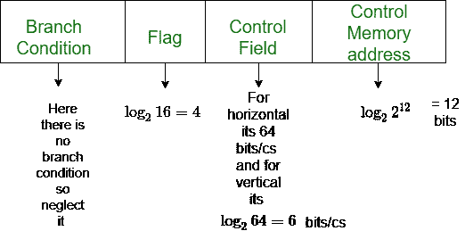

# 水平和垂直微编程控制单元之间的差异

> 原文:[https://www . geeksforgeeks . org/水平和垂直差异-微编程控制单元/](https://www.geeksforgeeks.org/difference-between-horizontal-and-vertical-micro-programmed-control-unit/)

先决条件–[硬连线 v/s 微编程控制单元](https://www.geeksforgeeks.org/computer-organization-hardwired-vs-micro-programmed-control-unit/)
基本上，**控制单元(CU)** 是在控制信号的帮助下以适当的顺序运行计算机全部功能的引擎。在**微编程**控制单元方法中，与操作相关的控制信号存储在特殊的存储单元中。将导致特定微操作发生的控制信号组视为“微指令”是很方便的。微指令序列可以存储在内部的“T7”控制“T8”存储器中。

根据存储在控制存储器中的控制字的类型，可将微编程控制单元分为两种类型，即:，水平微编程控制单元和垂直微编程控制单元。

*   在*水平微编程*控制单元中，控制信号以解码的二进制格式表示，即 1 位/CS。这里“n”个控制信号需要 n 位编码。另一方面。
*   在*垂直微编程*控制单元中，控制信号以编码的二进制格式表示。这里“n”个控制信号需要 log <sub>2</sub> n 位编码。

水平微程序控制单元和垂直微程序控制单元的比较:

| 水平编程控制单元 | 垂直编程控制单元 |
| --- | --- |
| 它支持更长的控制字。 | 它支持较短的控制字。 |
| 它允许更高的并行度。如果度数为 n，则一次启用 n 个控制信号。 | 它允许低并行度，即并行度不是 0 就是 1。 |
| 不需要额外的硬件。 | 需要解码器形式的附加硬件来产生控制信号。 |
| 它比垂直微编程控制单元更快。 | 它比水平微编程控制单元慢。 |
| 它不如垂直微编程控制单元灵活。 | 它比水平微程序控制单元更灵活。 |
| 水平微程序控制单元使用水平微指令，其中控制字段中的每一位都连接到一条控制线。 | 垂直微程序控制单元使用垂直微指令，其中每个要执行的动作使用一个代码，编码器将这个代码转换成单独的控制信号。 |
| 水平微编程控制单元比垂直微编程控制单元使用较少的只读存储器编码。 | 垂直微编程控制单元更多地使用只读存储器编码来减少控制字的长度。 |

**示例:**考虑一个支持 4 k 字的假设控制单元。硬件包含 64 个控制信号和 16 个标志。位中使用的控制字和字节中使用的控制存储器的大小是多少:
a)水平编程
b)垂直编程

**解决方案:**



```
a)For Horizontal 

64 bits for 64 signals
Control Word Size = 4 + 64 + 12 = 80 bits

Control Memory = 4 kW = ( (4* 80) / 8 ) = 40 kByte

a)For Vertical
6 bits for 64 signals i.e log264

Control Word Size = 4 + 6 + 12 = 22 bits

Control Memory = 4 kW = ( (4* 22) / 8 ) = 11 kByte

```