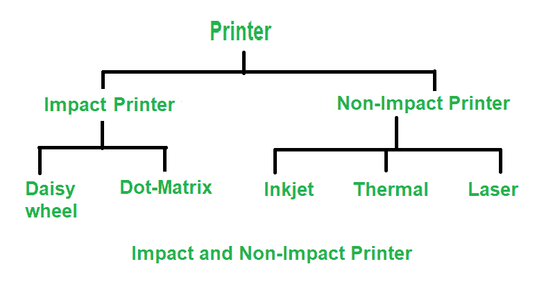

# 击打式和非击打式打印机的区别

> 原文:[https://www . geesforgeks . org/撞击打印机和非撞击打印机的区别/](https://www.geeksforgeeks.org/difference-between-impact-and-non-impact-printers/)

**冲击式和非冲击式打印机**是打印机的两个类别。冲击式打印机包括用于进行打印的机械部件。在非冲击式打印机中，不使用机械移动部件。

**冲击打印机:**
它是一种通过墨带与纸张直接接触来工作的打印机。这些打印机通常声音很大，但至今仍在使用，因为它们具有处理多部分表单的独特功能。冲击式打印机的机械装置类似于打字机。
冲击打印机、点阵打印机、菊花轮打印机和行式打印机的示例。

**非击打式打印机:**
这是一种不击打色带进行打印的打印机。他们使用激光、静电、化学和喷墨技术。非冲击式打印机通常安静得多。与早期的冲击式打印机相比，它们不太可能需要维护或修理。
无冲击打印机的例子是喷墨打印机和激光打印机。

**击打式打印机和非击打式打印机的区别:**

| 击打式打印机 | 无冲击打印机 |
| --- | --- |
| 通过击打在一张纸上产生字符和图形，称为击打式打印机。 | 一种打印机，可以在一张纸上打印出字符和图形，而不会引人注目。 |
| 它通过敲击一组金属针或字符集来打印。 | 印刷是通过沉积任何形式的墨水来完成的。 |
| 使用机电设备 | 没有使用机电设备。 |
| 更快的速度约为每秒 250 字。 | 较慢的速度约为每 30 秒 1 页。 |
| 有针在纸上敲打的声音 | 默默工作 |
| 点阵打印机、菊花轮式打印机、行式打印机都是例子。 | 喷墨打印机、照片打印机、激光打印机就是例子。 |

