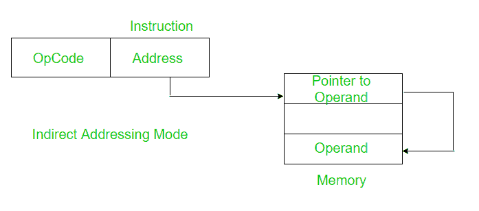

# 间接寻址模式和直接寻址模式的区别

> 原文:[https://www . geesforgeks . org/间接寻址和立即寻址模式之间的区别/](https://www.geeksforgeeks.org/difference-between-indirect-and-immediate-addressing-modes/)

先决条件–[寻址模式](https://www.geeksforgeeks.org/addressing-modes/)

**1。间接寻址模式:**
在间接寻址模式下，指令中的地址字段指向操作数的有效地址所在的存储单元或寄存器。

需要两次内存访问。一个用于获取存储在给定地址字段中的值。第二，在找到的地址获取操作数的有效地址。它可以进一步分为寄存器间接寻址和存储器间接寻址。



*例*:将寄存器 b 中存储的地址内容相加

```
ADD [B] 
```

指令的地址字段，这里是寄存器 B，保存操作数的地址。

**2。立即寻址模式:**
在立即寻址模式下，操作数是指令的一部分。

```
Here the Operand = Address Field 
```


*例*:累加器加 8。

```
ADD 8 
```

获取数据不需要内存引用。所以不需要额外的计算来计算有效地址。这是一个快速的方法。但缺点是它的范围有限

现在让我们比较直接寻址和立即寻址模式。

<center>

| 间接寻址模式 | 立即寻址模式 |
| --- | --- |
| 指令的地址字段保存操作数的地址。 | 没有地址字段，因为操作数是指令的一部分。 |
| 它需要两次引用内存。 | 它不需要任何对内存的引用。 |
| 它比即时模式慢。 | 这是一个更快的过程。 |
| 它比即时模式有更大的范围。 | 它的范围有限。 |
| 它进一步分为两类。 | 没有进一步的分类。 |
| 示例:添加[B] | 示例:ADD 5 |

</center>