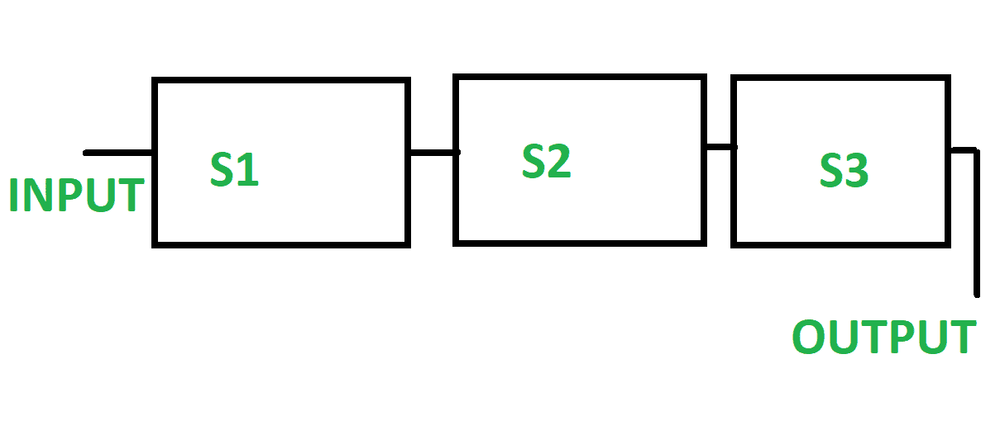
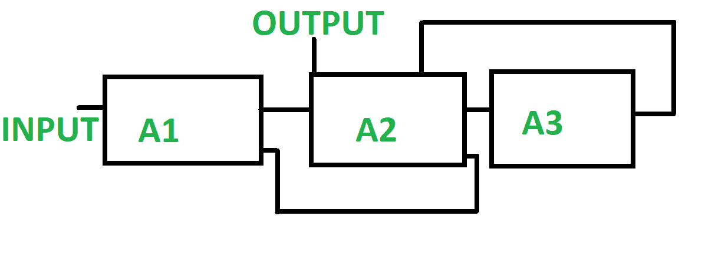

# 线性管道和非线性管道的区别

> 原文:[https://www . geesforgeks . org/线性管道和非线性管道的区别/](https://www.geeksforgeeks.org/difference-between-linear-pipeline-and-non-linear-pipeline/)

**1。线性流水线:**
线性流水线是一系列处理器以串行方式连接在一起的流水线。在线性流水线中，数据从处理器的第一块流向最后一块。数据的处理是以线性和顺序的方式进行的。输入被提供给第一块，我们从最后一块得到输出，直到数据处理完成。线性管道可以进一步分为同步和异步模型。

**2。非线性管道:**
非线性管道是由存在于不同阶段的不同管道组成的管道。不同的管线被连接以执行多种功能。它还具有反馈和前馈连接。它被制成在不同的时间间隔执行各种功能。在非线性流水线中，函数是动态分配的。

**线性管道和非线性管道的区别:**

| 没有 | 线性管道 | 非线性管道 |
| --- | --- | --- |
| 1. | 在线性流水线中，一系列处理器以串行方式连接在一起。 | 在非线性管道中，不同的管道出现在不同的阶段。 |
| 2. | 线性管道也称为静态管道，因为它执行固定的功能。 | 非线性管道也称为动态管道，因为它执行不同的功能。 |
| 3. | 输出总是从最后一块产生。 | 输出不一定是从最后一块产生的。 |
| 4. | 线性管道具有线性连接。 | 非线性管道具有反馈和前馈连接。 |
| 5. | 它生成一个预订表。 | 它可以生成多个预订表。 | 6. | 它允许简单的功能划分。 | 函数划分在非线性流水线中是困难的。 |

