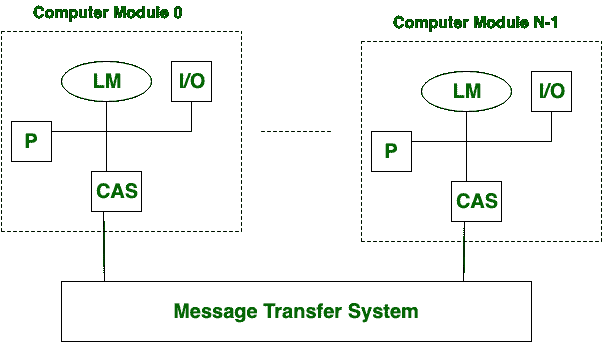
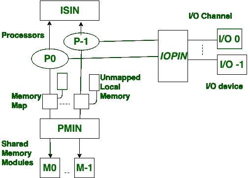

# 松耦合和紧耦合多处理器系统的区别

> 原文:[https://www . geesforgeks . org/松耦合和紧耦合多处理器系统之间的区别/](https://www.geeksforgeeks.org/difference-between-loosely-coupled-and-tightly-coupled-multiprocessor-system/)

**松耦合多处理器系统:**
它是一种多处理系统，其中存在分布式内存而不是共享内存。在松耦合多处理器系统中，数据速率比紧耦合多处理器系统低。在松散耦合的多处理器系统中，模块通过 MTS(消息传输系统)网络连接。

**紧耦合多处理器系统:**
这是一种多处理系统，其中有共享内存。在紧耦合多处理器系统中，数据速率比松耦合多处理器系统高。在紧耦合多处理器系统中，模块通过 PMIN、IOPIN 和 ISIN 网络连接。

让我们研究一下松耦合和紧耦合多处理器系统的区别:

| S.NO | 松散耦合 | 紧密耦合 |
| 1. | 松耦合多处理器系统中存在分布式内存。 | 在紧密耦合的多处理器系统中，存在共享内存。 |
| 2. | 松耦合多处理器系统数据速率低。 | 紧耦合多处理器系统具有高数据速率。 |
| 3. | 松耦合多处理器系统的成本更低。 | 紧密耦合的多处理器系统成本更高。 |
| 4. | 在松耦合多处理器系统中，模块通过**消息传输系统**网络连接。 | 同时还有 PMIN、IOPIN 和 ISIN 网络。 |
| 5. | 在松散耦合的多处理器中，不会发生内存冲突。 | 而紧密耦合多处理器系统存在内存冲突。 |
| 6. | 松耦合多处理器系统任务之间的交互程度低。 | 紧耦合多处理器系统具有高度的任务间交互。 |
| 7. | 在松散耦合的多处理器中，处理器和输入输出设备之间有直接的连接。 | 在紧密耦合的多处理器中，IOPIN 有助于处理器和输入/输出设备之间的连接。 |
| 8. | 松耦合多处理器在分布式计算系统中的应用。 | 紧耦合多处理器的应用是在并行处理系统中。 |