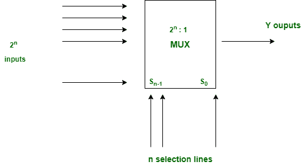
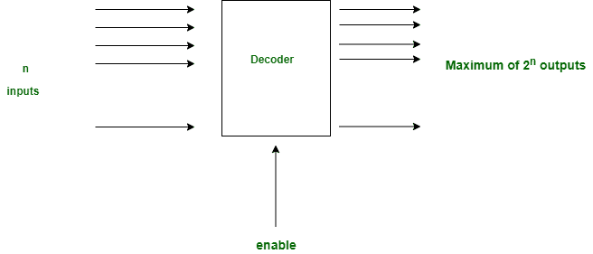

# 多路复用器和解码器之间的差异

> 原文:[https://www . geesforgeks . org/多路复用器和解码器之间的差异/](https://www.geeksforgeeks.org/difference-between-multiplexer-and-decoder/)

**1。[多路复用器](https://www.geeksforgeeks.org/multiplexers-in-digital-logic/) :**
多路复用器是一个数据选择器，它接受几个输入并给出一个输出。在多路复用器中，我们有 2 n 条输入线和 1 条输出线，其中 n 是选择线的数量。

**2。[解码器](https://www.geeksforgeeks.org/binary-decoder-in-digital-logic/) :**
解码器是将 n 条输入线转换为 m 条输出线的逻辑电路。解码器被称为最小项和最大项生成器，因为对于每个输入组合，只有一个输出是真的。

**多路复用器和解码器的区别:**

| 没有 | 多路器 | 解码器 |
| --- | --- | --- |
| 1. | 多路复用器接受多个输入，只允许一个数据输出。 | 它取 n 个输入二进制码并将其转换成相应的输出。 |
| 2. | 选择线用于选择数据输入，并且只允许其中一个。 | 使能输入用于控制解码器的操作。 |
| 3. | 它可以用于数据路由和波形生成。 | 解码器在十进制编码中的应用。 |
| 4. | 多路复用器将一元码转换成二进制码 | 解码器将二进制代码转换为一元代码.. |

