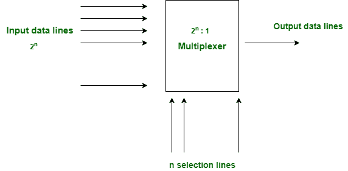
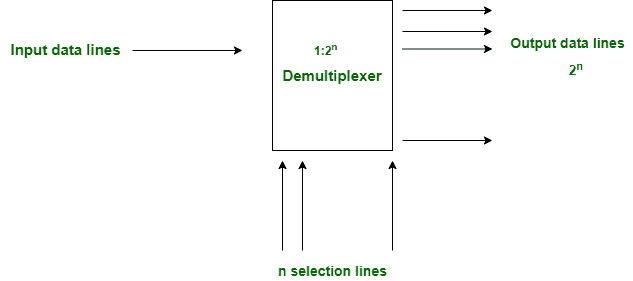

# 复用器和解复用器的区别

> 原文:[https://www . geesforgeks . org/多路复用器和多路分解器之差/](https://www.geeksforgeeks.org/difference-between-multiplexer-and-demultiplexer/)

**1。[多路复用器](https://www.geeksforgeeks.org/multiplexers-in-digital-logic/) :**
多路复用器是一个数据选择器，它接受几个输入并给出一个输出。在多路复用器中，我们有 2 n 条输入线和 1 条输出线，其中 n 是选择线的数量。

**2。多路分解器:**
多路分解器是一个数据分配器，它接受一个输入并给出几个输出。在解复用器中，我们有 1 条输入线和 2 条 n 输出线，其中 n 是选择线。

**复用器和解复用器的区别:**

| 多路器 | 多路解调器 |
| --- | --- |
| 多路复用器将来自不同来源的数字信息处理成单一来源。 | 解复用器从单个源接收数字信息，并将其转换成多个源 |
| 它被称为数据选择器 | 它被称为数据分发器 |
| 多路复用器是一种数字开关 | 多路分解器是一种数字电路 |
| 它遵循组合逻辑类型 | 它也遵循组合逻辑类型 |
| 它有 n 个数据输入 | 它只有一个数据输入 |
| 它只有一个数据输出 | 它有 n 个数据输出 |
| 它的工作原理是多对一 | 它的工作原理是一对多 |
| 在时分多路复用中，多路复用器用在发射机端 | 在时分多路复用中，多路分解器用于接收器端 |

