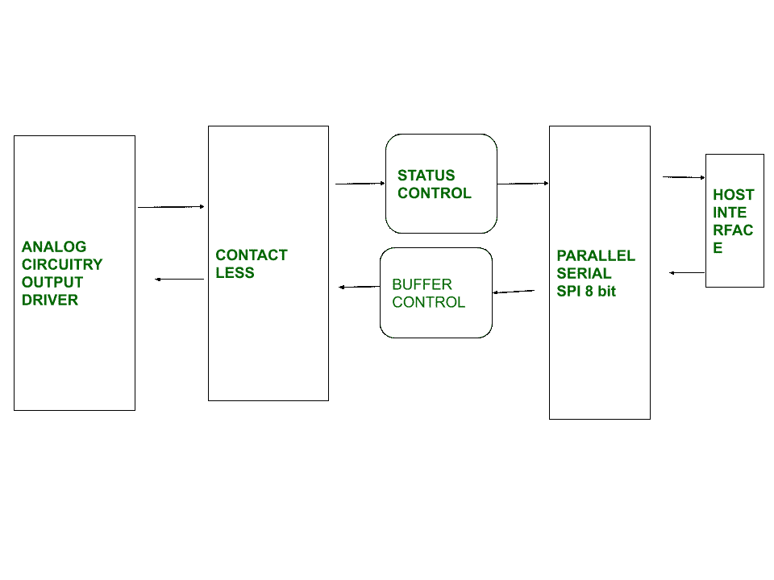

# 近场通信(NFC)和射频识别(RFID)的区别

> 原文:[https://www . geesforgeks . org/近场通信-nfc 和射频识别-rfid 之间的差异/](https://www.geeksforgeeks.org/difference-between-near-field-communication-nfc-and-radio-frequency-identification-rfid/)

**1。近场通信(NFC) :**
NFC 是一种短距离高频无线通信技术，主要用于移动或手持设备。它通过触摸两部手机或者将它们保持在几厘米的范围内来提供无线电通信。只需将两个设备相互握持，并在最后几厘米使用无线通信接口，即可轻松选择目标。NFC 通信主要基于感应耦合，使用两个环形天线之间的磁感应工作，工作频率为 13.56 兆赫，数据速率为 106 至 424 比特/秒。

NFC 主动模式和被动模式有两种类型的模式。在主动模式下，两个设备都可以产生电磁场并相互交换信息。在被动模式下，只有一个主动用户，它包含其他设备可以读取的信息，但它不会自己读取任何信息。

**2。射频识别(RFID) :**
RFID 是一种利用互联网的自动识别方法。其中在射频识别标签中数字编码的数据可以被类似于条形码的读取器读取，并且从标签读取的数据被读取器存储在数据库中。它由两部分组成，一个集成电路和一个天线，标签被保护材料覆盖，保护材料起到屏蔽各种环境影响的作用。这可能被动和主动和被动的射频识别标签是最常用的标签。

它源自(AIDC)自动识别和数据捕获技术，用于数据收集和将收集的数据映射到计算机系统。它利用无线通信和射频识别利用无线电波来执行 AIDC 功能。

**近场通信(NFC)和射频识别(RFID)的区别:**

<figure class="table">

| 基础关闭 | 国家足球联盟 | 射频识别（Radio Frequency Identification） |
| 发达的 | 近场通信技术于 2002 年引入。 | 射频识别技术是在 1980 年引入的。 |
| 定义 | 近场通信它是一种短距离高频无线通信技术，主要用于移动或手持设备。 | 射频识别是一种利用互联网的自动识别方法，其中数据被数字编码在射频识别标签中。 |
| 标签 | 近场通信标签本质上是被动的。 | 射频识别标签本质上可以是有源的或无源的，也可以是半无源的。 |
| 沟通 | 近场通信提供双向通信。 | 射频识别单向通信。 |
| 结构 | 其中只有内置近场通信的智能手机。 | 其中我们添加了一些额外的标签和阅读器。 |
| 安全 | 它提供中等安全特性。 | 它提供了像错过阅读复制或基本安全等功能。 |
| 抽样 | 采样存在于近场通信中。 | 射频识别中不存在采样。 |
| 频率范围。 | 在近场通信中，我们只工作在 13.56 兆赫的高频，同时充当阅读器和标签。由于读取范围短，设备必须非常接近。 | 

射频识别包含三种类型的范围。

*   低频-125-134khz
*   高频-13.56 兆赫
*   超高频-856mhzto 960mhz

 |
| 流行用途 | 

近场通信标签通常用于..

*   使用 NFC 支付账单。
*   跟踪汽车里程。
*   共享数据。
*   通过相互点击在两个设备之间共享和传输信息。
*   非接触式支付

 | 

射频识别标签一般用于

*   资产跟踪
*   工具跟踪
*   比赛时间
*   访问控制
*   库存跟踪

 |
| 范围 | 0.2m | 100 米 |
| 功率消耗 | 424 kbit | 因频率而异。 |
| 设置 | 中等。 | 难以设置。 |
| 费用 | 低。 | 高的 |
| 最大覆盖长度 | 10 厘米 | 3m |

</figure>