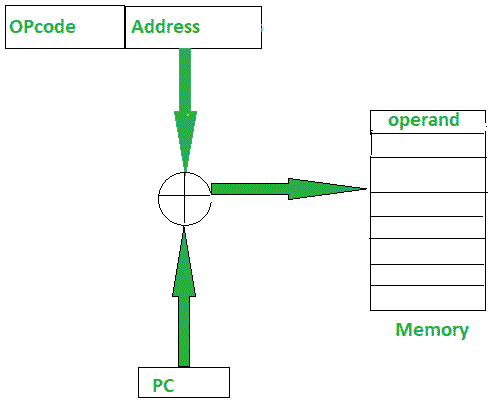
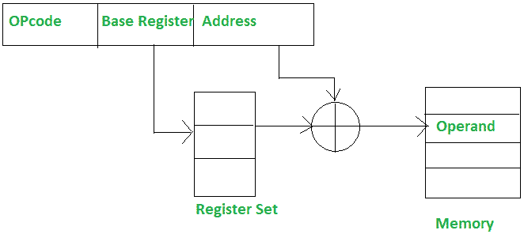

# pc 机相对和基址寄存器寻址模式的区别

> 原文:[https://www . geesforgeks . org/PC-relative-and-base-register-addressing-modes 之差/](https://www.geeksforgeeks.org/difference-between-pc-relative-and-base-register-addressing-modes/)

先决条件–[寻址模式](https://www.geeksforgeeks.org/addressing-modes/)

**1。PC 机相对寻址方式:**
PC 机相对寻址方式用于实现控制的段内转移，在这种方式下，通过给 PC 机增加位移来获得有效地址。

```
EA = PC + Address field value
PC = PC + Relative value 
```



**2。基址寄存器寻址模式:**
基址寄存器寻址模式用于实现控制的段间转移。在这种模式下，有效地址是通过将基址寄存器值加到地址字段值上获得的。

```
EA = Base register + Address field value
PC = Base register + Relative value 
```



**个人计算机相对和基本寄存器寻址模式之间的差异:**

<center>

| 电脑相对寻址模式 | 基本寄存器寻址模式 |
| --- | --- |
| 程序计数器的内容被添加到指令 I 的寻址字段，以获得有效地址。 | 基本寄存器内容被添加到指令的寻址字段，以获得有效地址。 |
| 指令的寻址字段大部分是有符号的数字，可以是正数，也可以是负数。 | 基址寄存器保存基址，指令的寻址字段根据基址给出位移。 |
| 程序计数器总是跟踪存储在其存储器中的程序指令。 | 根据指令，必须从寄存器组中选择特定的寄存器。 |
| 使用更多的位，因为它必须直接指定内存地址。 | 使用较少的位，因为它必须从寄存器集中选择一个寄存器。 |
| 程序计数器总是包含要执行的下一条指令的地址。提取指令中提到的地址后，程序计数器值立即增加。 | 在基本寄存器寻址模式下，位移值可以与引用所需地址所需的值相同，因为它不会立即转到下一条指令。 | 操作数的有效地址是通过将程序计数器内容添加到指令的寻址字段中获得的。 | 操作数的有效地址是通过将基本寄存器内容添加到指令的寻址字段中获得的。 | EA = PC +地址字段值
PC = PC +相对值 | EA =基址寄存器+地址字段值
PC =基址寄存器+相对值 |

</center>