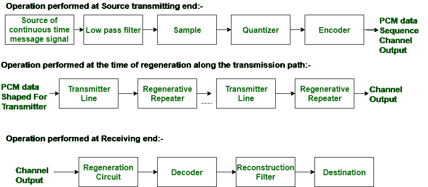
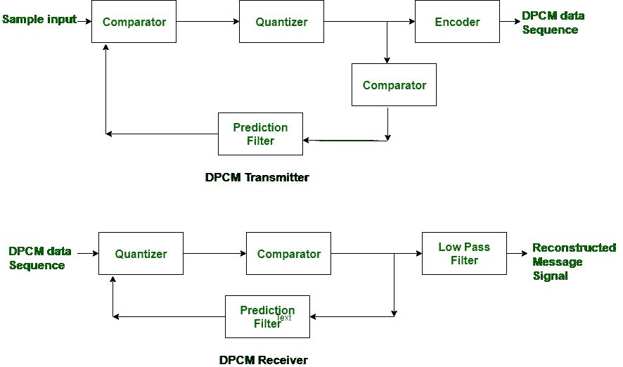

# PCM 和 DPCM 的区别

> 原文:[https://www . geesforgeks . org/PCM 和-dpcm 之间的差异/](https://www.geeksforgeeks.org/difference-between-pcm-and-dpcm/)

**脉码调制(PCM):**
PCM 是用于将模拟信号重塑为数字信号的技术。脉码调制具有良好的信噪比。对于传输信道，脉码调制比 DPCM 需要更高的带宽。

动力系统控制模块方法分为三个部分，最初是在供应端完成传输，在传输路径和接收端完成第二次再生。

这些步骤如下图所示:

**差分脉码调制(DPCM):**
DPCM 与用于将模拟信号重塑为数字信号的 PCM 技术相同。DPCM 的信噪比适中。

DPCM 不同于 PCM，因为它量化了特定样本和预期价格的区别。这就是它被称为差分 PCM 的解释。

DPCM 发射机和 DPCM 接收机的操作如下图所示:

让我们看看 PCM 和 DPCM 之间的区别，如下所示:

<figure class="table">

| S.NO | 脉冲编码调制 | DPCM |
| --- | --- | --- |
| 1. | PCM 代表脉冲编码调制。 | 而 DPCM 代表差分脉冲编码调制。 |
| 2. | 在动力系统控制模块中，不提供反馈。 | 在 DPCM，提供反馈。 |
| 3. | 它具有良好的信噪比。 | 同时具有中等的信噪比。 |
| 4. | 它不如 DPCM 有效率。 | 而它比 PCM 更有效率。 |
| 5. | 对于传输通道，PCM 需要高带宽(B)。 | 而 DPCM 比 PCM 需要更少的带宽。 |
| 6. | 就复杂性而言，PCM 比 DPCM 复杂。 | 而 DPCM 在复杂性方面很简单。 |
| 7. | 在 PCM 中，每八个样本传输七个比特。 | 在 DPCM，每六个样本传输四个比特。 |
| 8. | 在脉码调制中，传输比特率从 55 到 64 不等。 | 而在 DPCM，传输比特率从三十二到四十八不等。 |

</figure>