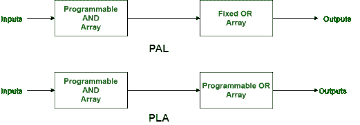

# 可编程逻辑阵列与编程阵列逻辑的区别

> 原文:[https://www . geesforgeks . org/可编程逻辑阵列与编程阵列逻辑之间的区别/](https://www.geeksforgeeks.org/difference-between-programmable-logic-array-and-programming-array-logic/)

[可编程逻辑阵列(PLA)](https://www.geeksforgeeks.org/programmable-logic-array/) 和[编程阵列逻辑(PAL)](https://www.geeksforgeeks.org/programming-array-logic/) 是编程逻辑器件的范畴。

在 PLA 或可编程逻辑阵列中，有大量的功能可以实现。而在 PAL 或可编程阵列逻辑中，可以实现有限的功能。
PLA 和 PAL 的区别在于，PAL 有可编程的 and 阵列和固定的 or 阵列。另一方面，PLA 有可编程的 and 阵列和可编程的 OR 阵列。

让我们看看 PLA 和 PAL 的区别:

| S.NO | 中国人民解放军（the People's Liberation Army） | 朋友 |
| 1. | PLA 代表可编程逻辑阵列。 | 而 PAL 代表可编程阵列逻辑。 |
| 2. | PLA 速度比 PAL 低。 | 而 PAL 的速度比 PLA 高。 |
| 3. | PLA 的复杂度很高。 | 而 PAL 的复杂度就比较低了。 |
| 4. | PLA 的成本也很高。 | 而 PAL 的成本较低。 |
| 5. | 可编程逻辑阵列不太可用。 | 而可编程阵列逻辑比可编程逻辑阵列更可用。 |
| 6. | 它比 PAL 少用。 | 虽然它比 PLA 更常用。 |