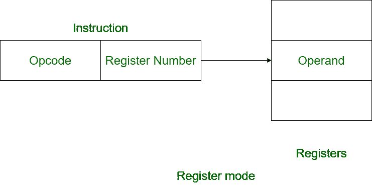
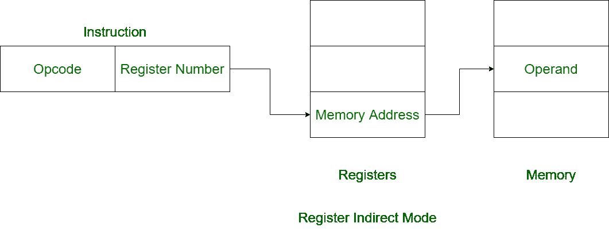

# 寄存器模式和寄存器间接模式的区别

> 原文:[https://www . geesforgeks . org/register-mode 和 register-间接-mode 的区别/](https://www.geeksforgeeks.org/difference-between-register-mode-and-register-indirect-mode/)

先决条件–[寻址模式](https://www.geeksforgeeks.org/addressing-modes/)

**1。寄存器模式:**
在寄存器寻址模式下，操作数被置于 8 位或 16 位通用寄存器之一。数据在指令指定的寄存器中。



**示例:**

```
MOV R1, R2 
```

指令有寄存器 R2，R2 有操作数。

**2。寄存器间接寻址模式:**
在寄存器间接寻址模式下，操作数的地址放在任何一个寄存器中。指令指定包含操作数地址的寄存器。



**示例:**

```
ADD R1, (R2) 
```

指令有寄存器 R2，R2 有操作数的存储地址。

**语域模式与语域间接模式的区别:**

<center>

| 注册模式 | 注册间接模式 |
| --- | --- |
| 操作数放在通用寄存器中。 | 操作数的偏移量放在一个寄存器中。 |
| 在寄存器模式下，地址字段包含操作数的有效地址。 | 在寄存器间接模式下，地址字段包含有效地址的引用。 |
| 它只需要一个寄存器引用来访问数据。 | 访问数据需要两个寄存器引用。 |
| 执行该操作不需要进一步计算。 | 需要进一步计算才能找到有效地址。 |
| 寄存器寻址模式很快。 | 寄存器间接寻址模式很慢。 |
| 在寄存器模式下更容易访问数据。 | 以寄存器间接模式访问数据有点复杂。 |
| 它使用临时变量。 | 它使用指针。 |

</center>