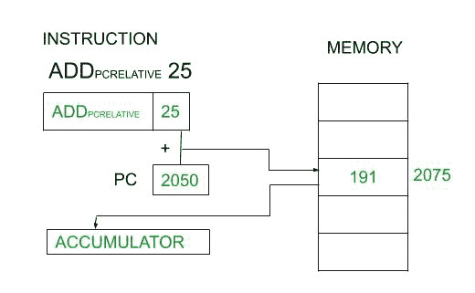

# 相对寻址模式和直接寻址模式的区别

> 原文:[https://www . geesforgeks . org/相对寻址模式和直接寻址模式的区别/](https://www.geeksforgeeks.org/difference-between-relative-addressing-mode-and-direct-addressing-mode/)

先决条件–[寻址模式](https://www.geeksforgeeks.org/addressing-modes/)
在指令周期过程的取指令操作中，寻址模式起着至关重要的作用。寻址模式是指在实际执行之前，在指令字中对操作数进行寻址的方式。

**1。相对地址模式:**
在这种模式下，操作数的有效地址(EA)是通过将 CPU 寄存器的内容和指令字的地址部分相加来计算的。有效地址通过将位移(指令中给出的立即值)和寄存器值相加来计算。指令的地址部分通常是一个带符号的数字，可以是正数，也可以是负数。这样计算的有效地址是相对于下一条指令的地址的。

```
EA = CPU Register + Displacement
```

[](https://media.geeksforgeeks.org/wp-content/uploads/20200830223820/PCRelativeMode.jpg) 

<center>**Figure –** PC Relative Addressing Mode</center>

Relative Addressing Mode can be further classified into three types –

*   程序计数器相对寻址模式。
*   索引寄存器相对寻址模式或索引寻址模式。
*   基址寄存器寻址模式。

**2。直接寻址模式:**
在直接寻址模式下，操作数的有效地址等于指令的地址部分，即指令的地址部分表示包含操作数的内存位置。

**示例–**
添加 R1，4000 其中 4000 是该位置的有效地址。

[](https://media.geeksforgeeks.org/wp-content/uploads/20200908215237/DirectModerevised.jpg) 

<center>**Figure –** Direct Address Mode</center>

在这个例子中，存储单元 4000 包含操作数 100，其被添加到 R1 的内容中并被存储在 R1。

**相对寻址模式和直接寻址模式的区别:**

<center>

| 没有 | 相对寻址模式 | 直接寻址模式 |
| 1. | 有效地址是通过将中央处理器寄存器的内容与指令的地址部分相加来计算的。 | 提取操作数的地址已经在指令的地址部分提供。不算。 |
| 2. | 相对模式有三种:PC 机相对、索引寄存器相对、基址寄存器相对寻址模式。 | 直接寻址模式没有类型。 |
| 3. | 这导致指令格式中的地址字段较短，因为相对地址可以用少量的位来指定。 | 这导致指令格式中的地址字段更长，因为它需要更多的位数来指定整个存储器地址。 |
| 4. | 它经常与分支类型指令一起使用，因为它直接更新程序计数器。 | 它不用于分支类型的指令。 |
| 5. | 它用于编写可重定位代码，位置无关代码，即用于运行时的程序重定位。 | 它用于访问静态数据。 |
| 6. | 它用于实现数组寻址、记录。 | 它用于实现变量。 |
| 7. | 它用于处理递归过程。 | 它不能处理递归过程。 |

</center>