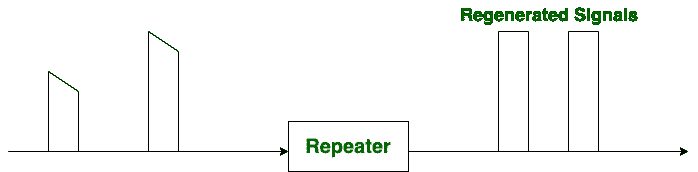
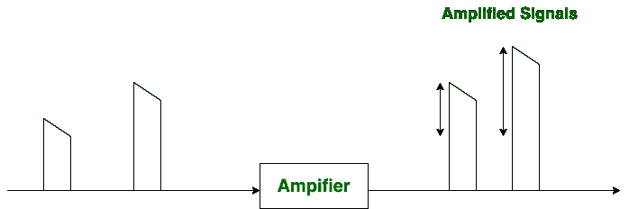

# 中继器和放大器的区别

> 原文:[https://www . geesforgeks . org/直放站和放大器之间的差异/](https://www.geeksforgeeks.org/difference-between-repeater-and-amplifier/)

**中继器**和**放大器**都是电子设备。
**中继器:**
中继器用于重新产生信号，然后发射，如果发现之前发射的信号较弱。中继器采用高输入功率，提供低输出功率。信号的噪声也可以通过再生信号来降低。

**放大器:**
如果发现之前发送的信号较弱，放大器用于增加信号的幅度或强度。它采用低输入功率并提供高输出功率。

**中继器和放大器的区别:**
中继器和放大器的主要区别在于中继器被用作再生信号，而放大器只是增加信号的幅度。

| S.NO | 中继器 | 放大器 |
| 1. | 如果提供的原始信号很弱，中继器会重新生成信号。 | 放大器增加信号的振幅。 |
| 2. | 中继器采用高输入功率，提供低输出功率。 | 放大器采用低输入功率并提供高输出功率。 |
| 3. | 中继器通常用于静态(固定)环境。 | 放大器通常用于移动和远程区域网络。 |
| 4. | 中继器重新产生信号，以便降低或消除噪声。 | 放大器随着噪声增加信号的振幅。 |
| 5. | 中继器工作在 OSI 模型的物理层。 | 放大器一般用于无线通信。 |