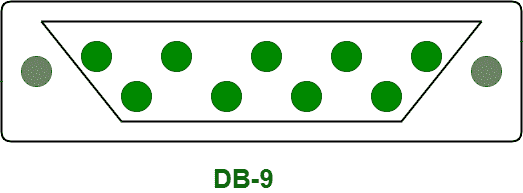
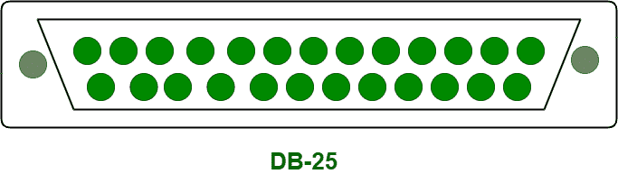

# 串口和并口的区别

> 原文:[https://www . geesforgeks . org/串行端口和并行端口的区别/](https://www.geeksforgeeks.org/difference-between-serial-port-and-parallel-ports/)

先决条件–[计算机中的端口介绍](https://www.geeksforgeeks.org/introduction-of-ports-in-computers/)
**1。串口:**
串口是用来连接串口线路，实现串行通信的接口。这些端口可以对接一个连接到传输线的 9 针 D 形连接器，称为 DB-9 连接器。通过单线实现串行通信，只有单个数据流从一端传输到另一端。因此，像并行传输一样，在串行传输中数据速度不匹配不是问题。电线的长度可以根据需要增加。

与并行端口传输速度相比，串行端口的传输速度相对较低。串行端口通常在调制解调器、连接设备、控制器、鼠标以及安全摄像头中实现。DB-9 引脚连接器示意图如下。

**2。并行端口:**
与串行端口不同，并行端口可以在八条不同的线路上一次移动一组 8 位。这就是为什么它比串行通信更快。与串行端口不同，它使用 25 针连接器，称为 DB-25 连接器。为了消除串扰和错误，在并行通信中，所有比特流都需要以相同的速度传输数据。但是，这不切实际。因此，出于这个原因，在并行通信中，传输线优选为短的。

并行端口通常在 zip 驱动器、打印机、硬盘驱动器、光盘驱动器等中实现。DB-25 引脚连接器示意图如下。

**串口和并口的区别:**

| S.NO | 串行端口 | 并行端口 |
| --- | --- | --- |
| 1. | 串口用于实现串行传输。 | 而并行端口用于实现并行传输。 |
| 2. | 与并行端口传输速度相比，串行端口的传输速度相对较低。 | 而并口的传输速度高于串口的传输速度。 |
| 3. | 在串行端口通信中，使用较少数量的导线。 | 而在并行端口通信中，与串行端口相比，使用了更多的导线。 |
| 4. | 串行端口能够传送单个数据流。 | 而并行端口能够传送多个数据流。 |
| 5. | 串口一次发送一点又一点。 | 而并行端口一次发送多个位。 |
| 6. | 串行端口包括阳端口。 | 在并行端口中，会涉及到母端口。 |
| 7. | 串行端口通常在调制解调器、连接设备、安全摄像头和控制器中实现。 | 并行端口通常在 zip 驱动器、打印机、硬盘驱动器、光盘驱动器等中实现。 |

