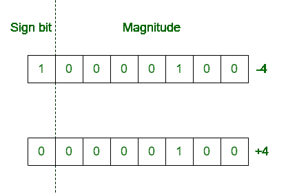
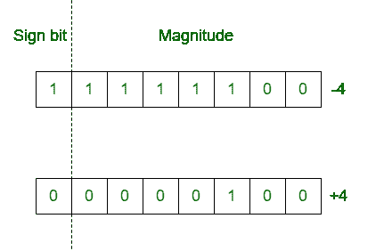

# 符号幅度和 2 的补码之间的差值

> 原文:[https://www . geeksforgeeks . org/带符号幅度差和-2s 补码/](https://www.geeksforgeeks.org/difference-between-signed-magnitude-and-2s-complement/)

**1。符号幅度法:**
在符号幅度法中数字分为两部分:符号位和幅度。负数的符号位为 1，正数的符号位为 0。数字的大小用数字的二进制形式表示。
**例:**取 8 位寄存器。

**2。2 的补码法:**
在 2 的补码法中，正数的表示方式与符号幅度法相同。但是如果这个数是负数，首先用正号表示这个数，然后取这个数的 2 的补码。
**例:**取 8 位寄存器。

**符号幅度与 2 的补码法之差:**

| 符号幅度法 | 2 的补码法 |
| --- | --- |
| 这是一种表示定点带符号数的方法。 | 它也用来表示定点有符号数。 |
| 数字分为两部分。 | 数字被视为一个整体。 |
| 符号位被明确考虑。 | 符号位不被明确考虑。 |
| 算术的合成符号需要额外的硬件。 | 2 的补码方法不需要额外的硬件。 |
| 加法和减法是在单独的硬件上执行的。 | 加法和减法仅通过使用加法器来执行。 |
| 它对 0 有两种不同的表示。一个是+0，第二个是-0。(+0 : 0000 0000) & (-0 : 1000 0000) | 0 对于-0 和+0 (+0 或-0 : 0000 0000)只有一种表示形式。 |
| 它是非加权系统。 | 它为符号位分配负权重。 |