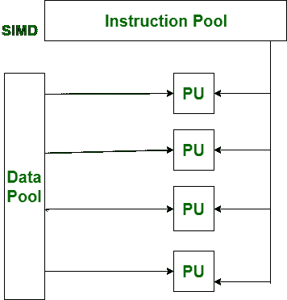
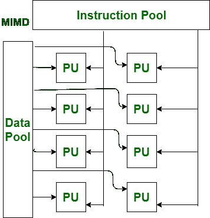

# SIMD 和 MIMD 的区别

> 原文:[https://www . geesforgeks . org/SIMD 和-mimd 之间的差异/](https://www.geeksforgeeks.org/difference-between-simd-and-mimd/)

[迈克尔·弗林将计算机组织](https://www.geeksforgeeks.org/computer-architecture-flynns-taxonomy/)分为 SIMD 和 MIMD。
其中， **SIMD** 代表**单指令多数据。** **MIMD** 代表**多指令多数据。**
在 SIMD 设计中，一条指令在恒定时间应用于一串信息或不同的数据。就绩效而言，SIMD 不如 MIMD 高效。

另一方面，MIMD 设计同时在完全不同的信息上应用多个方向。就业绩而言，MIMD 比 SIMD 更有效率。

SIMD 和 MIMD 的主要区别在于，SIMD 只有一个解码器。而 MIMD 有多个解码器。

让我们看看 SIMD 和 MIMD 的区别:

| S.NO | SIMD | MIMD |
| 1. | SIMD 代表单指令多数据。 | 而 MIMD 代表多指令多数据。 |
| 2. | SIMD 需要很少或更少的内存。 | 而它需要更多或更大的内存。 |
| 3. | SIMD 的成本比 MIMD 低。 | 虽然它比 SIMD 贵。 |
| 4. | 它只有一个解码器。 | 而它有多个解码器。 |
| 5. | 它是潜在的或隐性的同步。 | 而它是精确的或显式的同步。 |
| 6. | SIMD 是一个同步编程。 | 而 MIMD 是异步编程。 |
| 7. | 就复杂性而言，SIMD 比 MIMD 简单。 | 而 MIMD 在复杂性方面比 SIMD 复杂。 |
| 8. | 就绩效而言，SIMD 不如 MIMD 高效。 | 而 MIMD 在绩效方面比 SIMD 更有效率。 |