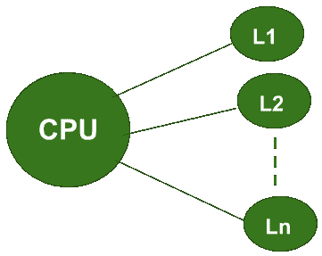
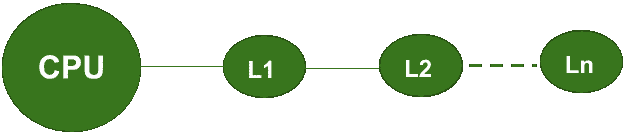
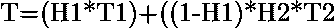
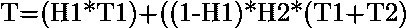

# 同时存取和分级存取存储器组织的区别

> 原文:[https://www . geeksforgeeks . org/同时和分级访问内存组织之间的区别/](https://www.geeksforgeeks.org/difference-between-simultaneous-and-hierarchical-access-memory-organisations/)

在计算机系统设计中，根据中央处理器试图访问不同级别内存的方式，内存组织主要分为两种主要类型。

这两种类型包括**同时存取存储器组织**和**分级存取存储器组织**。让我们从下表中了解两者之间的区别:

**Figure –** Simultaneous Access Memory Organisation

**Figure –** Hierarchical Access Memory Organisation

**同时存取和分级存取存储器组织的区别:**

| 同时存取存储器组织 | 分级存取存储器组织 |
| --- | --- |
| 在这个组织中，中央处理器直接连接到所有级别的内存。 | 在这个组织中，中央处理器总是直接连接到 L1
，即只有一级内存。 |
| 中央处理器同时访问各级存储器的数据。 | 中央处理器总是从一级存储器访问数据。 |
| 对于在 L1 内存中遇到的任何*未命中，CPU 可以直接从更高的内存级别
访问数据(即 L2、L3、…..Ln)。* | 对于在 L1 内存中遇到的任何*未命中，CPU 无法从更高的内存级别(即 L2、L3、…)直接访问数据..Ln)。首先，所需的数据将从较高的内存级别传输到 L1 内存。
只有这样，它才能被中央处理器访问。* |
| If H1 and H2 are the Hit Ratios and T1 and T2 are the access time of L1 and L2 memory levels respectively then the
*Average Memory Access Time* can be calculated as: | If H1 and H2 are the Hit Ratios and T1 and T2 are the access time of L1 and L2 memory levels respectively then the
*Average Memory Access Time* can be calculated as: |

<u>**注:**</u>

1.  默认情况下，计算机系统的内存结构是用分级访问内存组织设计的。这是因为在这种类型的内存组织中，由于引用的局部性，平均访问时间减少了。
2.  同步访问内存组织用于实现*直写缓存*。
3.  在两种类型的内存组织中，最后一个内存级别的命中率始终为 1。