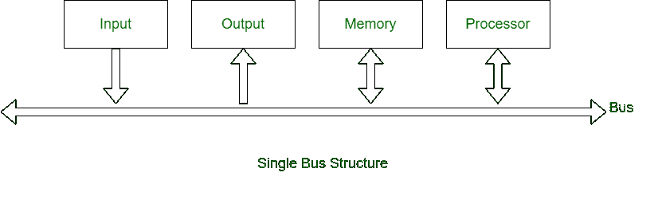
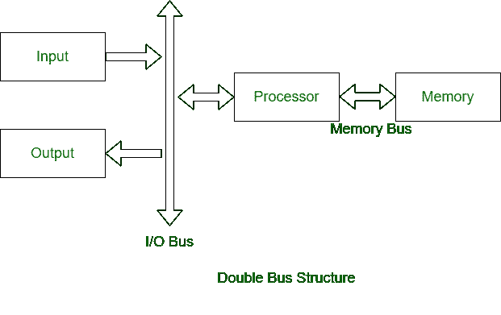

# 单母线结构与双母线结构的区别

> 原文:[https://www . geesforgeks . org/单总线结构和双总线结构的区别/](https://www.geeksforgeeks.org/difference-between-single-bus-structure-and-double-bus-structure/)

**1。单总线结构:**
在单总线结构中，用于外设和微处理器之间通信的一条公共总线。由于使用一条公共总线，它有缺点。

**2。双总线结构:**
在双总线结构中，一条总线用于取指令，另一条总线用于取数据，需要执行。是为了克服单总线结构的瓶颈。

**单总线与双总线结构差异:**

| 单总线结构 | 双总线结构 |
| --- | --- |
| 一条公共总线用于外设和处理器之间的通信。 | 使用两条总线，一条用于外围设备的通信，另一条用于处理器。 |
| 指令和数据都在同一总线上传输。 | 指令和数据都在不同的总线上传输。 |
| 它的性能很低。 | 它的性能很高。 |
| 单母线结构成本低。 | 双母线结构成本高。 |
| 执行的周期数更多。 | 执行周期数较少。 |
| 流程执行缓慢。 | 流程执行速度快。 |
| 关联的寄存器数量较少。 | 关联的寄存器数量更多。 |
| 一次只能从总线上读取一个操作数。 | 一次可以读取两个操作数。 |

