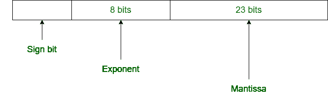
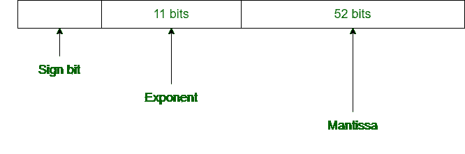

# 单精度和双精度的区别

> 原文:[https://www . geesforgeks . org/单精度和双精度之间的差异/](https://www.geeksforgeeks.org/difference-between-single-precision-and-double-precision/)

根据 IEEE 标准，[浮点数有两种表示方式](https://www.geeksforgeeks.org/floating-point-representation-basics/):

| **精度** | **基地** | **标志** | **指数** | 意思 |
| 单精度 | Two | one | eight | 23+1 |
| 双倍精密度 | Two | one | Eleven | 52+1 |

**1。单精度:**
单精度是 IEEE 提出的一种表示浮点数的格式。它在计算机内存中占据 32 位。

**2。双精度:**
双精度也是 IEEE 给出的一种表示浮点数的格式。它在计算机内存中占据 64 位。

**单精度和双精度的区别:**

| 单精度 | 双倍精密度 |
| --- | --- |
| 在单精度中，32 位用于表示浮点数。 | 在双精度中，64 位用于表示浮点数。 |
| 它使用 8 位表示指数。 | 它使用 11 位作为指数。 |
| 在单精度中，尾数使用 23 位。 | 在双精度中，尾数使用 52 位。 |
| 偏差数为 127。 | 偏差数为 1023。 |
| 单精度数字范围: **2^(-126)** 至 **2^(+127)** | 双精度数字范围: **2^(-1022)** 到 **2^(+1023)** |
| 这用于精度不太重要的地方。 | 这用于精度更重要的地方。 |
| 它用于广泛的表示。 | 它用于近似的最小化。 |
| 它用于简单的程序，如游戏。 | 它用于复杂的程序，如科学计算器。 |
| 这叫做 binary32。 | 这叫做 binary64。 |

详见[浮点表示](https://www.geeksforgeeks.org/introduction-of-floating-point-representation/)。