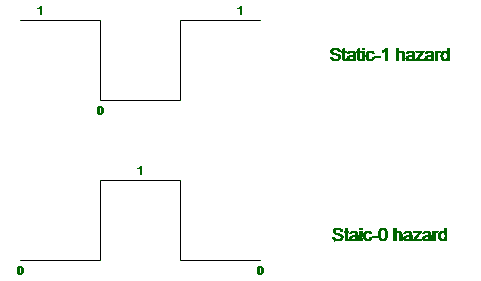

# 静态-1 和静态-0 危险的区别

> 原文:[https://www . geesforgeks . org/static-1 和 static-0 之间的差异-危害/](https://www.geeksforgeeks.org/difference-between-static-1-and-static-0-hazard/)

静态危险发生在组合电路中，可以通过使用冗余门来消除。静态危险分为:

**1。Static-1 危险:**
如果输出当前处于逻辑状态 1，并且在输入改变其状态之后，同时输出在稳定在 1 之前变为 0，则它是 Static-1 危险。

**2。静态-0 危险:**
如果输出当前处于逻辑状态 0，并且在输入改变其状态之后，同时输出在稳定在 0 之前变为 1，那么它是静态-0 危险。

**静态-1 和静态-0 危险的区别:**

<figure class="table">

| 静态-1 危险 | 静态-0 危险 |
| --- | --- |
| 输出从 1 变为 0。 | 输出从 0 变为 1。 |
| 短时间间隔内为假“0”级别。 | 短时间间隔内为假“1”级别。 |
| “与或”电路产生静电危害。 | “与非”或“或非”电路产生静态 0 危险。 |
| 图表从高到低再到高。 | 图表从低到高，然后再低。 |
| 接触网的静态 1 危害是一种集合危害。 | 接触网的静态 0 风险是割集风险。 |
| 标准操作程序用于消除静电危害。 | POS 用于消除静电危害。 |
| 我们处理静态 1 危险中的 1。 | 我们在静态 0 危害中处理 0。 |

</figure>