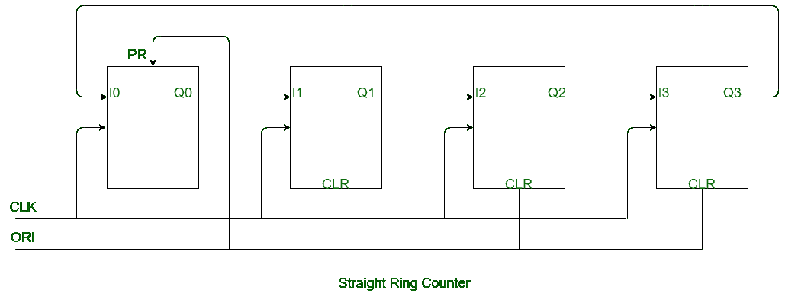
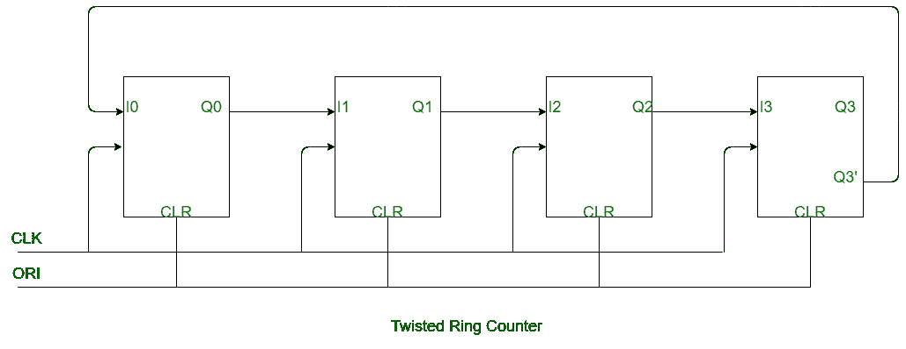

# 直环计数器和扭环计数器的区别

> 原文:[https://www . geesforgeks . org/直环计数器和扭环计数器的区别/](https://www.geeksforgeeks.org/difference-between-straight-ring-counter-and-twisted-ring-counter/)

[环形计数器](https://www.geeksforgeeks.org/ring-counter-in-digital-logic/)是一种由连接到移位寄存器的触发器组成的计数器。它有两种类型:

**1。直环计数器:**
直环计数器是一种环形计数器，其中最后一个触发器的输出连接到第一个触发器的输入。它在环上循环一个“0”或“1”位。

**2。扭曲环形计数器:**
扭曲环形计数器是一种环形计数器，其中最后一个移位寄存器的输出补码连接到第一个寄存器的输入。它在环上循环一串 1，然后是 0。

**直环计数器和扭环计数器的区别:**

| 直环计数器 | 扭曲环形计数器 |
| --- | --- |
| 它将最后一个移位寄存器的输出连接到第一个移位寄存器的输入。 | 它将最后一个移位寄存器的输出补码连接到第一个寄存器的输入。 |
| 它被称为 One hot counter。 | 它被称为步行环计数器。 |
| 它在环上循环一位(0 或 1)。 | 它循环流 1，然后是流 0。 |
| 在第一个移位寄存器中使用预置。 | 预置不用于扭环计数器。 |
| CLEAR 用于最后(n-1)个触发器。 | “清除”用于其中的所有翻转。 |
| 它用于逐次逼近和步进电机控制。 | 它用于相移或函数发生器。 |

