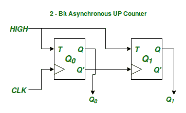
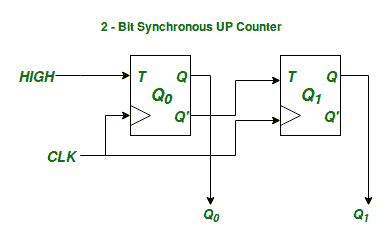

# 同步和异步时序电路的区别

> 原文:[https://www . geesforgeks . org/同步和异步时序电路之间的区别/](https://www.geeksforgeeks.org/difference-between-synchronous-and-asynchronous-sequential-circuits/)

[时序电路](https://www.geeksforgeeks.org/digital-logic-introduction-sequential-circuits/)是那些具有*内部状态*概念的电路。*内部状态*的概念是必要的，因为在时序电路中，电路的输出是当前输入和过去输入的函数。时序电路的内部状态只不过是电路过去输入的反映。现在，时序电路的内部状态由多个*状态变量*表示。每个状态变量可以处于两种可能状态中的一种。这是因为状态变量是在触发器的帮助下物理实现的，每个触发器只能表示 2 种可能的状态。因此，如果我们有“N”个触发器，我们最多可以表示 2 个 <sup>N</sup> 状态。

```
Max. No. of States with 'N' Flip-Flops = 
```

这意味着具有“N”个触发器的时序电路最多只能处于个内部状态。

现在让我们用一个使用 T 触发器的同步和异步 2 位二进制上行计数器的例子来说明同步和异步时序电路之间的区别。



<center>**Figure –** 2-bit Binary Asynchronous UP Counter</center>



<center>**Figure –** 2-bit Binary Synchronous UP Counter</center>

在上述两个电路中是表示上述每个电路的*内部状态*的状态变量。由于有 2 个状态变量，上述时序电路可以处于 4 种可能的状态，计数器的功能是以特定的顺序在这 4 种状态中循环。

同步电路和异步电路的区别在于电路如何从一个内部状态进入下一个内部状态。在同步时序电路中，代表电路内部状态的所有状态变量随着给定的输入时钟信号同时改变它们的状态，以达到下一个状态。

另一方面，在异步电路的情况下，所有的状态变量可能不会同时改变它们的状态来达到下一个稳定的内部状态。换句话说，状态变量不与任何通用时钟信号同步。

**比较–**

<center>

| 同步电路 | 异步电路 |
| --- | --- |
| 所有**状态变量**的变化都与通用时钟信号同步。 | **状态变量**不同步同时改变，可以随时改变而不考虑彼此，以达到下一个**稳定内部状态** |
| 由于所有内部状态变化都在主时钟源的严格控制之下，因此它们不太容易出现故障或争用情况，因此更加可靠。 | 由于没有这样的通用时钟源，一旦任何输入发生变化，内部状态就会改变，因此更容易出现争用情况。 |
| 内部状态变化的时间由我们控制。 | 异步电路内部状态的变化不受我们控制。 |

</center>