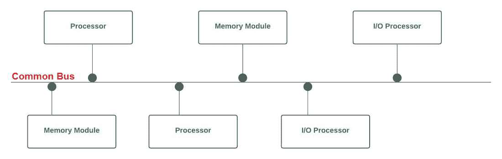
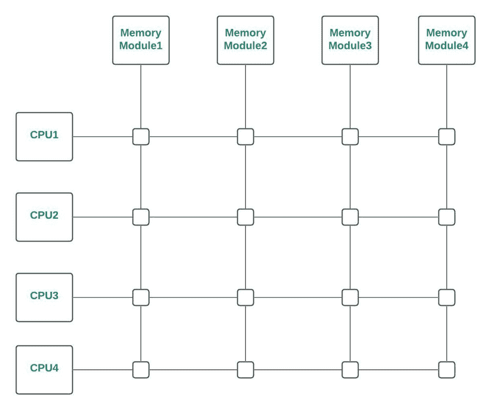
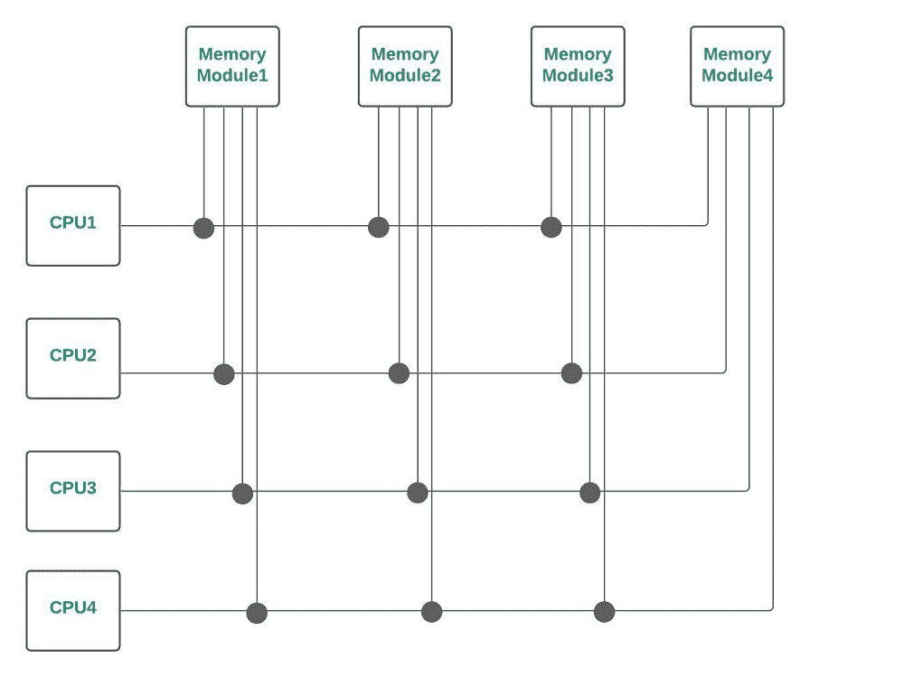

# 分时总线、交叉开关&多端口存储器–互连结构

之间的差异

> 原文:[https://www . geesforgeks . org/时间差-共享总线-交叉开关-多端口-内存-互连-结构/](https://www.geeksforgeeks.org/difference-between-time-shared-bus-crossbar-switch-multiport-memory-interconnection-structure/)

**前提:**详细研究[时间共享总线](https://write.geeksforgeeks.org/post/2699988)、[纵横制交换机](https://www.geeksforgeeks.org/crossbar-switch/) & [多端口存储器](https://www.geeksforgeeks.org/multiport-memory-multiprocessor-system/)互联结构。

**简介:**
互联结构可以决定多处理器环境下系统的整体性能。处理器必须能够在多处理器系统中共享一组主内存模块&输入/输出设备。这种共享能力可以通过互连结构来提供。常用的互连结构可以给出如下:

1.  [时间共享/公共总线(之前讨论过)](https://write.geeksforgeeks.org/post/2699988)
2.  [横杆开关](https://www.geeksforgeeks.org/crossbar-switch/)
3.  [多端口存储器](https://www.geeksforgeeks.org/multiport-memory-multiprocessor-system/)
4.  [多级交换网络(之前讨论过)](https://write.geeksforgeeks.org/post/2703122)
5.  [超立方体系统](https://www.geeksforgeeks.org/hypercube-interconnection/#:~:text=Related%20Articles&text=Hypercube%20(or%20Binary%20n%2Dcube,a%20node%20of%20the%20cube.)

**时间共享/公共总线:**
在多处理器系统中，时间共享总线互连提供了连接所有功能单元的公共通信路径。

多处理器系统中的分时/公共总线

**十字开关:**
如果公共总线系统中的总线数量增加，则到达每个内存模块都有单独路径可用的点。交叉开关(对于多处理器)为每个模块提供了单独的路径。

横杆开关

**多端口存储器:**
在多端口存储器系统中，控制、交换&优先级仲裁逻辑分布在交叉开关矩阵中，交叉开关矩阵分布在存储器模块的接口处。

多端口存储器

**分时总线、纵横制交换机&多端口存储器:**T2 之间的差异】

|   | **时间共享总线** | **纵横制交换机** | **多端口存储器** |
| 1. | 硬件成本最低且最简单。 | 对于多处理器来说，成本效益高，因为只需要一个基本的交换矩阵(来组装功能单元。) | 由于大多数控制和开关电路都在存储单元中，因此价格昂贵。 |
| 2. | 系统扩展会降低性能。 | 系统扩展可以提高性能。 | 系统(设计)很难扩展。 |
| 3. | 总的来说，系统容量限制了传输速率&如果总线出现故障，整个系统都会出现故障。 | 传输速率高，但更复杂。 | 总传输速率非常高的潜力。 |
| 4. | 修改硬件系统配置很容易。 | 系统的扩展有限，仅受开关矩阵大小的限制。 | 需要大量的电缆和连接器。 |
| 5.  | 我们不能同时从所有内存模块进行传输。 | 我们可以同时从所有内存模块进行传输。 | 我们可以同时从所有内存模块进行传输。 |
| 6. | 最低效率&仅适用于较小的系统。 | 功能单元是最简单和最便宜的。 | 功能单元允许低成本的单处理器。 |