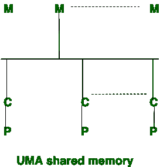
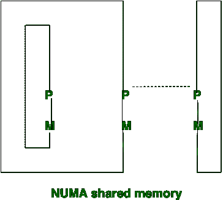

# 统一内存访问(UMA)和非统一内存访问(NUMA)的区别

> 原文:[https://www . geesforgeks . org/uniform-memory-access-uma 和-non-uniform-memory-access-numa 之间的区别/](https://www.geeksforgeeks.org/difference-between-uniform-memory-access-uma-and-non-uniform-memory-access-numa/)

[多处理器](https://www.geeksforgeeks.org/computer-architecture-multiprocessor-and-multicomputer/)可以分为三种共享内存模型，它们是:

1.  统一内存访问
2.  非统一内存访问(NUMA)
3.  仅缓存内存访问

**统一内存访问(UMA):**
在 UMA 中，使用单个内存控制器。统一内存访问比非统一内存访问慢。在统一内存访问中，带宽是受限制的，而不是非统一内存访问。统一内存访问中使用的总线有三种:单总线、多总线和交叉总线。它适用于通用应用和分时应用。

**非统一内存访问(NUMA):**
在 NUMA，使用不同的内存控制器。非统一内存访问比统一内存访问更快。非统一内存访问适用于实时应用程序和时间关键型应用程序。

让我们看看 UMA 和 n UMA 的区别:

| S.NO | 一个 | NUMA |
| 1. | UMA 代表统一内存访问。 | NUMA 代表非统一内存访问。 |
| 2. | 在统一内存访问中，使用单个内存控制器。 | 在非统一内存访问中，使用不同的内存控制器。 |
| 3. | 统一内存访问比非统一内存访问慢。 | 非统一内存访问比统一内存访问更快。 |
| 4. | 统一内存访问的带宽有限。 | 非统一内存访问比统一内存访问有更多的带宽。 |
| 5. | 统一内存访问适用于通用应用和分时应用。 | 非统一内存访问适用于实时应用程序和时间关键型应用程序。 |
| 6. | 在统一内存访问中，内存访问时间是平衡的或相等的。 | 在非均匀内存访问中，内存访问时间不相等。 |
| 7. | 统一内存访问中使用的总线有三种:单总线、多总线和交叉总线。 | 而在非统一内存访问中，使用的总线有两种类型:树型和层次型。 |

