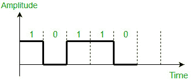
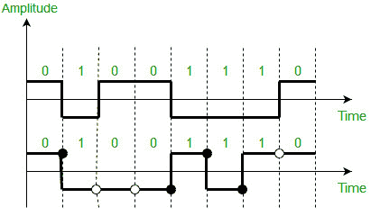
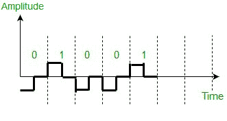
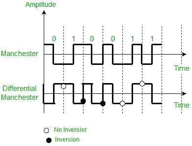
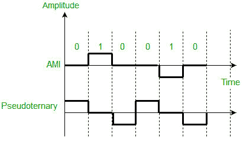

# 单极性、极性和双极性线路编码方案的区别

> 原文:[https://www . geesforgeks . org/单极性和双极性线路编码方案之间的差异/](https://www.geeksforgeeks.org/difference-between-unipolar-polar-and-bipolar-line-coding-schemes/)

**数据**和**信号**表示数据可以是数字或模拟的。**线路编码**是将**数字数据转换为数字信号**的过程。通过这种技术，我们把一个比特序列转换成数字信号。在发送端，数字数据被编码成数字信号，在接收端，数字数据通过解码数字信号而被重新创建。

我们可以将线路编码方案大致分为五类:

1.  单极性(如 NRZ 方案)。
2.  极地(例如 NRZ-L、NRZ-I、RZ 和双相-曼彻斯特和差分曼彻斯特)。
3.  双极(如急性心肌梗死和伪三元)。
4.  多层次的
5.  多次转移

但是，在学习前三种方案之间的区别之前，我们应该首先了解这些线路编码技术的**特征**:

*   应该有**自同步**，即接收方和发送方的时钟都应该同步。
*   应该有一些错误检测能力。
*   应该对噪音和干扰有免疫力。
*   应该没那么复杂。
*   不应该有低频分量( **DC 分量**)，因为长距离传输对于低频分量信号是不可行的。
*   基线漂移应该会少一些。

**单极方案–**
在该方案中，所有信号电平要么在轴的上方，要么在轴的下方。

*   **Non return to zero (NRZ) –** It is unipolar line coding scheme in which positive voltage defines bit 1 and the zero voltage defines bit 0\. Signal does not return to zero at the middle of the bit thus it is called NRZ. For example: Data = 10110.

    

    但是与极性方案相比，这种方案使用更多的功率来发送每单位线路电阻一个比特。此外，对于连续的 0 或 1 集合，会出现自同步和基线漂移问题。

**极坐标方案–**
在极坐标方案中，电压位于轴的两侧。

*   **NRZ-L and NRZ-I –** These are somewhat similar to unipolar NRZ scheme but here we use two levels of amplitude (voltages). For **NRZ-L(NRZ-Level)**, the level of the voltage determines the value of the bit, typically binary 1 maps to logic-level high, and binary 0 maps to logic-level low, and for **NRZ-I(NRZ-Invert)**, two-level signal has a transition at a boundary if the next bit that we are going to transmit is a logical 1, and does not have a transition if the next bit that we are going to transmit is a logical 0.

    **注意–**对于 NRZ-I，我们在示例中假设数据集“01001110”开始之前的前一个信号为正。因此，开始时没有转换，当前数据集“01001110”中的第一位“0”从+V 开始。示例:数据= 01001110。

    

    NRZ-L 和 NRZ-I 的比较:基线漂移对他们两个来说都是一个问题，但对 NRZ-L 来说，它比 NRZ-I 差一倍。这是因为 NRZ-I 边界处的跃迁(如果我们要传输的下一位是逻辑 1)。类似地，对于 0 的长序列，自同步问题在两者中都是相似的，但是对于 1 的长序列，自同步问题在 NRZ-L 中更为严重

*   **Return to zero (RZ) –** One solution to NRZ problem is the RZ scheme, which uses three values positive,negative,and zero. In this scheme signal goes to 0 in the middle of each bit.
    **Note –** The logic we are using here to represent data is that for bit 1 half of the signal is represented by +V and half by zero voltage and for bit 0 half of the signal is represented by -V and half by zero voltage. Example: Data = 01001.

    

    RZ 编码的主要缺点是需要更大的带宽。另一个问题是复杂性，因为它使用三个电平的电压。由于所有这些缺陷，这个方案今天没有被使用。取而代之的是表现更好的曼彻斯特和差分曼彻斯特计划。

*   **Biphase (Manchester and Differential Manchester ) –** Manchester encoding is somewhat combination of the RZ (transition at the middle of the bit) and NRZ-L schemes. The duration of the bit is divided into two halves. The voltage remains at one level during the first half and moves to the other level in the second half. The transition at the middle of the bit provides synchronization.

    差分曼彻斯特多少是 RZ 和 NRZ-I 方案的结合。位的中间总是有一个过渡，但位值是在位的开头确定的。如果下一位为 0，则有一个跃迁，如果下一位为 1，则没有跃迁。

    **注–**
    **1。**我们在这里使用 Manchester 来表示数据的逻辑是，对于位 1，在位的中间有一个从-V 到+V 伏特的转换，对于位 0，在位的中间有一个从+V 到-V 伏特的转换。
    **2。**对于差分曼彻斯特，我们在示例中假设数据集“010011”开始之前的前一个信号为正。因此，开始时有一个转换，当前数据集“010011”中的第一位“0”从-V 开始。示例:数据= 010011。

    

    曼彻斯特方案克服了与 NRZ-L 相关的几个问题，差分曼彻斯特克服了与 NRZ-1 相关的几个问题，因为没有基线漂移，也没有 DC 分量，因为每个比特都有正电压和负电压贡献。

    唯一的限制是曼彻斯特和差分曼彻斯特的最小带宽是 NRZ 的两倍。

**双极方案–**
在该方案中，有三个电压电平:正、负和零。一个数据元素的电压电平为零，而另一个元素的电压电平在正和负之间交替。

*   **交替标记反转(AMI)–**中性零电压代表二进制 0。二进制 1 由交替的正负电压表示。
*   **Pseudoternary –** Bit 1 is encoded as a zero voltage and the bit 0 is encoded as alternating positive and negative voltages i.e., opposite of AMI scheme. Example: Data = 010010.
    

    双极方案是 NRZ 的替代方案。该方案具有与 NRZ 相同的信号速率，但是没有 DC 分量，因为每次一个比特由电压零和其他交替表示。

**参考资料–**
[数据通信和网络](https://www.amazon.in/COMMUNICATIONS-NETWORKING-UPDATE-Behrouz-Forouzan/dp/0070499357?tag=googinhydr18418-21)作者:贝鲁兹·弗鲁赞(图书)