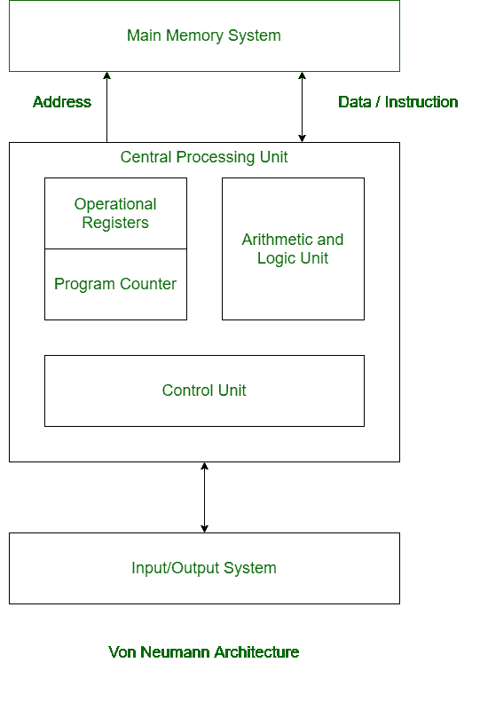
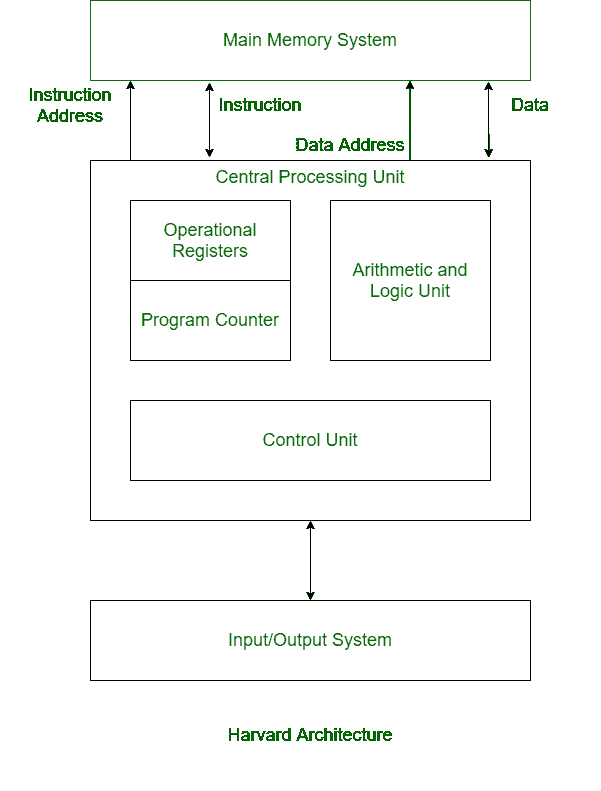

# 冯·诺依曼与哈佛建筑的区别

> 原文:[https://www . geesforgeks . org/von-neumann 和-harvard-architecture 之间的区别/](https://www.geeksforgeeks.org/difference-between-von-neumann-and-harvard-architecture/)

[**冯·诺依曼架构:**](https://www.geeksforgeeks.org/computer-organization-von-neumann-architecture/)
冯·诺依曼架构是一种数字计算机架构，其设计基于存储程序计算机的概念，其中程序数据和指令数据存储在同一存储器中。这个建筑是由著名的数学家和物理学家**约翰·冯·诺依曼**在 1945 年设计的。

[**哈佛架构:**](https://www.geeksforgeeks.org/harvard-architecture/)
哈佛架构是一种数字计算机架构，其设计基于这样一个概念，即有单独的存储器和用于指令和数据的单独总线(信号路径)。它基本上是为了克服冯·诺依曼架构的瓶颈而开发的。

**冯·诺依曼与哈佛建筑的区别:**

<figure class="table">

| 冯诺依曼系统结构 | 哈佛建筑 |
| --- | --- |
| 它是基于存储程序计算机概念的古代计算机体系结构。 | 它是基于哈佛 Mark I 继电器模型的现代计算机体系结构。 |
| 指令和数据使用相同的物理内存地址。 | 单独的物理内存地址用于指令和数据。 |
| 有一条用于数据和指令传输的公共总线。 | 单独的总线用于传输数据和指令。 |
| 执行一条指令需要两个时钟周期。 | 一条指令在一个周期内执行。 |
| 它在成本上更便宜。 | 它比冯·诺依曼架构贵。 |
| CPU 不能同时访问指令和读/写。 | CPU 可以同时访问指令和读/写。 |
| 它用于个人电脑和小型电脑。 | 它用于微控制器和信号处理。 |

</figure>