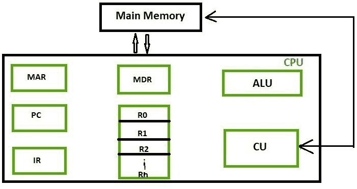

# 不同类别的中央处理器寄存器

> 原文:[https://www . geesforgeks . org/不同类别的 cpu 寄存器/](https://www.geeksforgeeks.org/different-classes-of-cpu-registers/)

在计算机体系结构中，寄存器是非常快速的计算机内存，用于高效地执行程序和操作。这是通过提供对常用值的访问来实现的，即当时处于操作/执行点的值。因此，为了这个目的，有几个不同类别的中央处理器寄存器与计算机内存协同工作，以有效地运行操作。

拥有寄存器的唯一目的是快速检索数据供中央处理器处理。虽然从内存访问指令相对来说比硬盘快，但对中央处理器来说还是不够的。为了更好的处理，中央处理器中有内存，可以从内存中获取将要预先执行的数据。在寄存器之后，我们有高速缓冲存储器，它比寄存器更快，但速度更慢。

这些分类如下。

*   **累加器:**
    这是最常用的寄存器，用于存储从内存获取的数据。它在不同的微处理器中有不同的数量。

*   **存储器地址寄存器(MAR):**
    它保存要从存储器访问的位置的地址。内存数据寄存器和内存数据寄存器一起促进了中央处理器和主内存的通信。

*   **存储器数据寄存器(MDR):**
    它包含要写入或从寻址位置读出的数据。

*   **通用寄存器:**
    这些寄存器编号为 R0、R1、R2。Rn-1，用于在任何正在进行的操作中存储临时数据。它的内容可以通过汇编编程来访问。现代的中央处理器体系结构倾向于使用更多的图形处理器，因此可以更多地使用寄存器到寄存器寻址，这比其他[寻址模式](https://www.geeksforgeeks.org/addressing-modes/)相对更快。

*   **程序计数器(PC):**
    程序计数器(PC)用于记录程序的执行情况。它包含要提取的下一条指令的内存地址。当前一条指令已经成功完成时，PC 指向要从主存储器中取出的下一条指令的地址。程序计数器(PC)也用于计算指令的数量。个人电脑的增长取决于所使用的架构类型。如果我们使用的是 32 位架构，那么每次获取下一条指令时，PC 都会递增 4。

*   **指令寄存器(IR):**
    IR 保存即将执行的指令。来自 PC 机的指令被提取并存储在红外存储器中。一旦指令被置于 IR 中，CPU 就开始执行该指令，并且 PC 指向要执行的下一条指令。

*   **条件码寄存器(CCR ) :**
    条件码寄存器包含不同的标志，用于指示任何操作的状态。例如，假设一个操作导致了负结果或零的产生，那么这些标志相应地被设置为高

1.  进位 C:如果加法运算产生进位或减法运算产生借位，则设置为 1；否则清 0。
2.  溢出 V:仅在对有符号整数进行操作时有用。
3.  零 Z:如果结果为 0，则设置为 1，否则清除为 0。
4.  求反 N:仅在有符号数运算中有意义。如果产生否定结果，则设置为 1。
5.  扩展 X:用作多精度算术运算的进位。

这些一般由 ALU 决定。

所以，这些是不同的寄存器，为特定的目的而工作。