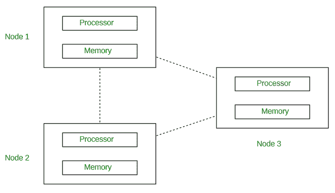
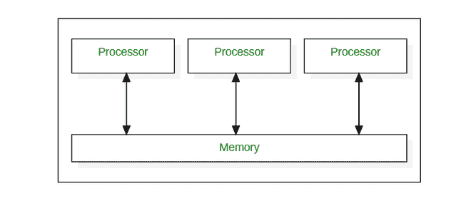
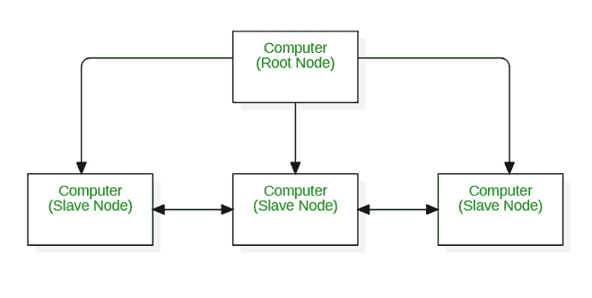
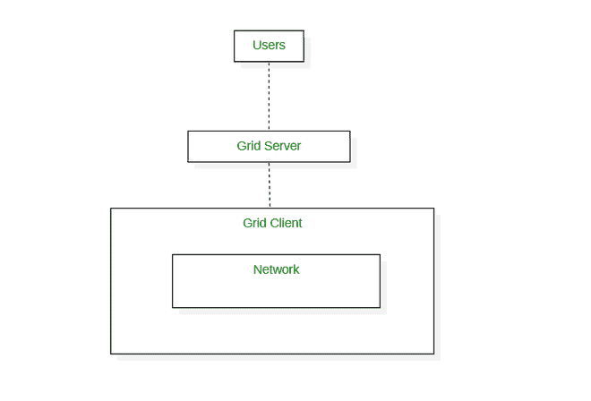
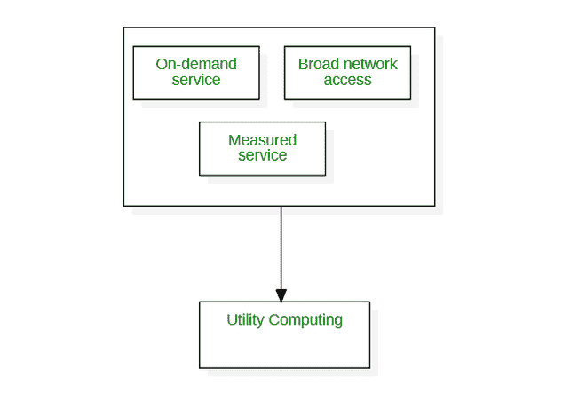
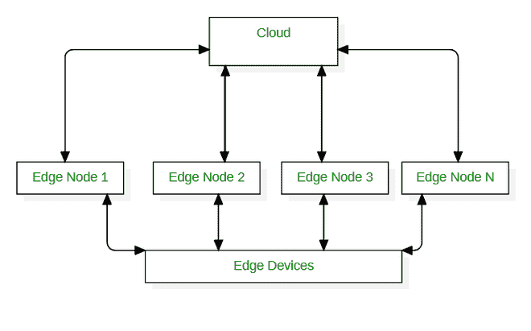
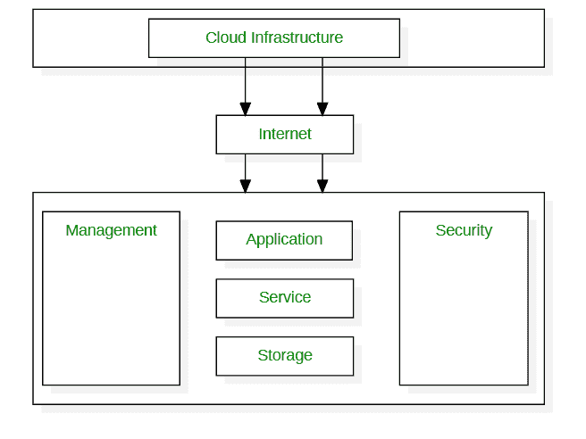

# 不同的计算范式

> 原文:[https://www . geesforgeks . org/different-computing-范型/](https://www.geeksforgeeks.org/different-computing-paradigms/)

多年来，已经开发和使用了不同的计算范例。事实上，在云计算范式之前，已经存在不同的计算范式。让我们看看下面所有的计算范例。

**1。分布式计算:**
分布式计算被定义为一种多计算机系统处理一个问题的计算类型。这里所有的计算机系统都连接在一起，问题被分成子问题，每个部分都由不同的计算机系统解决。
分布式计算的目标是提高系统的性能和效率，保证容错能力。
在下图中，每个处理器都有自己的本地内存，所有处理器都通过网络相互通信。

**2。并行计算:**
并行计算被定义为同时使用多个计算机系统的一种计算类型。在这里，问题被分解成子问题，然后进一步分解成指令。来自每个子问题的这些指令在不同的处理器上同时执行。

在下图中，您可以看到并行计算系统是如何由多个处理器组成的，这些处理器相互通信并通过共享内存同时执行多个任务。

并行计算的目标是节省时间和提供并发性。

**3。集群计算:**
集群是一组独立的计算机，它们一起工作来执行给定的任务。
集群计算被定义为一种由两台或多台独立的计算机(称为节点)组成的计算类型，它们作为一台机器一起工作来执行任务。

集群计算的目标是提高系统的性能、可扩展性和简单性。

如下图所示，所有节点(无论它们是父节点还是子节点)都作为一个实体来执行任务。

**4。网格计算:**
网格计算被定义为一种计算类型，它由计算机网络组成，这些计算机一起工作来执行单台机器可能难以处理的任务。该网络上的所有计算机都在同一保护伞下工作，被称为虚拟超级计算机。

他们处理的任务要么是高计算能力，要么是大型数据集。
网格计算中计算机系统之间的所有通信都是在“数据网格”上完成的。

网格计算的目标是用更少的时间解决更多的高计算量问题，提高生产率。

**5。效用计算:**
效用计算被定义为服务提供商向客户提供所需资源和服务，并根据需求和要求根据这些资源的使用情况对其收费，但不是固定费率的计算类型。

效用计算涉及硬件、软件等资源的租赁。这取决于需求和要求。

效用计算的目标是提高资源的利用率和成本效益。

**6。边缘计算:**
边缘计算被定义为专注于减少客户端和服务器之间长距离通信的计算类型。这是通过在云中运行更少的进程并将这些进程移动到用户的计算机、物联网设备或边缘设备/服务器上来实现的。

边缘计算的目标是将计算带到网络的边缘，这反过来建立更小的差距，并导致更好和更紧密的交互。

**7。雾计算:**
雾计算被定义为在云和数据产生设备之间充当计算结构的计算类型。它也被称为“雾化”。

这种结构使用户能够在彼此距离更近的位置分配资源、数据和应用程序。

雾计算的目标是提高网络的整体效率和性能。

**8。云计算:**
云被定义为使用他人的服务器来托管、处理或存储数据。
云计算被定义为一种计算类型，即通过互联网以现收现付的方式提供按需计算服务。它分布广泛，基于网络，用于存储。

云的类型有公共云、私有云、混合云和社区云，一些云提供商有谷歌云、AWS、微软 Azure 和 IBM 云。

