# 计算机组织|不同指令周期

> 原文:[https://www.geeksforgeeks.org/different-instruction-cycles/](https://www.geeksforgeeks.org/different-instruction-cycles/)

先决条件–[执行、阶段和吞吐量](https://www.geeksforgeeks.org/computer-organization-and-architecture-pipelining-set-1-execution-stages-and-throughput/)

每个指令周期中涉及的寄存器:

*   **内存地址寄存器(MAR)** :连接到系统总线的地址线。它为读或写操作指定内存中的地址。
*   **内存缓冲寄存器(MBR)** :连接到系统总线的数据线。它包含要存储在内存中的值或从内存中读取的最后一个值。
*   **程序计数器(PC)** :保存下一条待取指令的地址。
*   **指令寄存器(IR)** :保存最后提取的指令。

**指令周期–**

指令周期的每个阶段都可以分解成一系列基本微操作。在以上示例中，*获取、间接、执行和中断周期*各有一个序列。

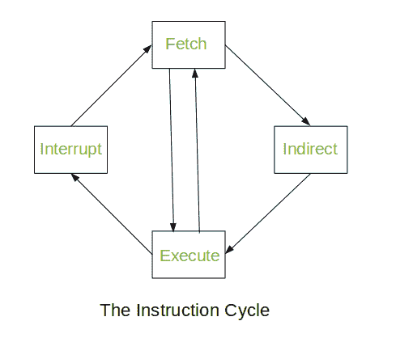

*间接循环*之后总是跟随*执行循环*。*中断周期*之后始终是*提取周期*。对于获取和执行周期，下一个周期取决于系统的状态。

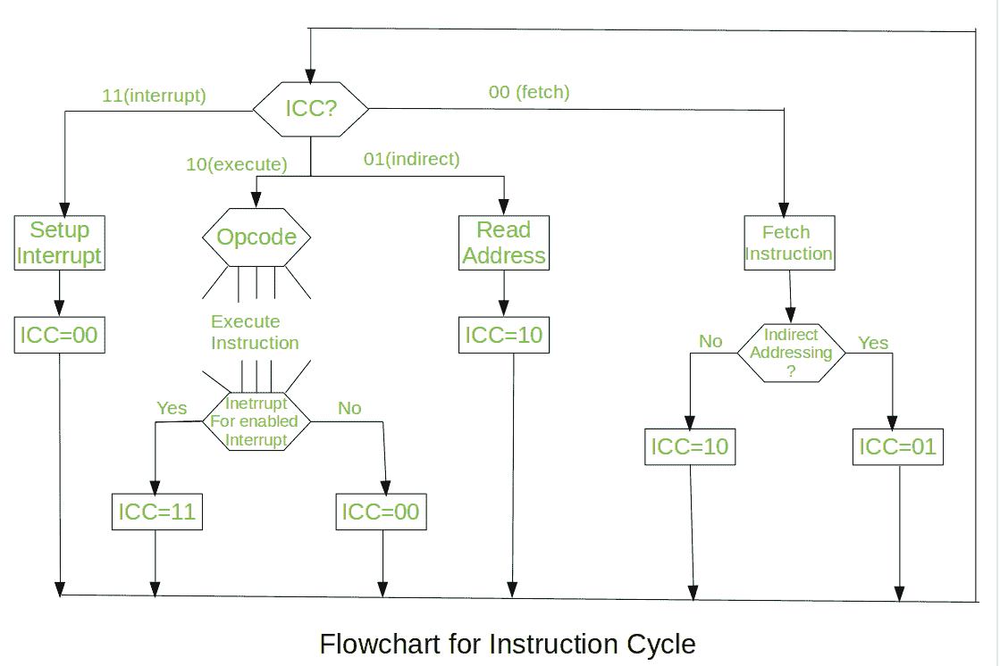

我们假设一个新的 2 位寄存器叫做*指令周期码* (ICC)。ICC 根据处理器处于周期的哪个部分来指定处理器的状态:-

00:获取周期
01:间接周期
10:执行周期
11:中断周期

在每个周期结束时，ICC 被适当地设置。*指令周期*的上述流程图描述了微操作的完整顺序，仅取决于指令顺序和中断模式(这是一个简化的例子)。处理器的操作被描述为一系列微操作的执行。

不同的指令周期:

*   **提取周期–**
    在提取周期开始时，下一条要执行的指令的地址在*程序计数器* (PC)中。

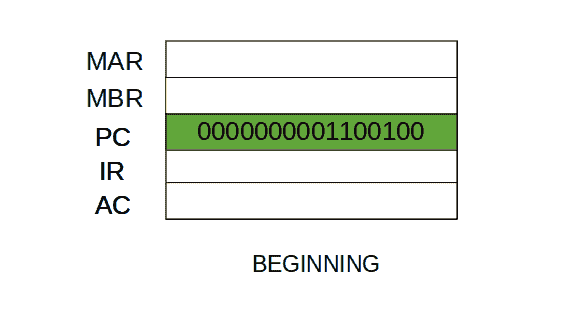

*   步骤 1:程序计数器中的地址被移动到存储器地址寄存器(MAR)，因为这是连接到系统总线地址线的唯一寄存器。

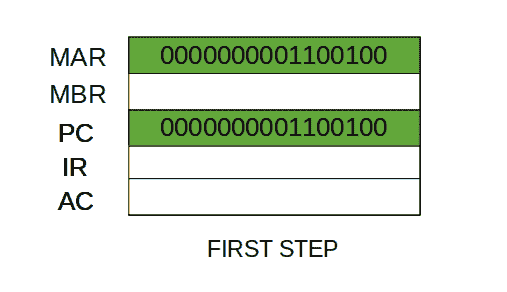

*   Step 2: The address in MAR is placed on the address bus, now the control unit issues a READ command on the control bus, and the result appears on the data bus and is then copied into the memory buffer register(MBR). Program counter is incremented by one, to get ready for the next instruction.(These two action can be performed simultaneously to save time) 

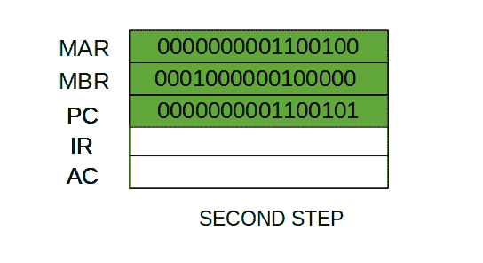

*   Step 3: The content of the MBR is moved to the instruction register(IR). 

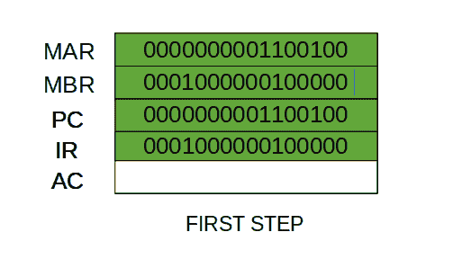

*   因此，一个简单的*提取周期*由三个步骤和四个微操作组成。象征性地，我们可以把这些事件的顺序写如下

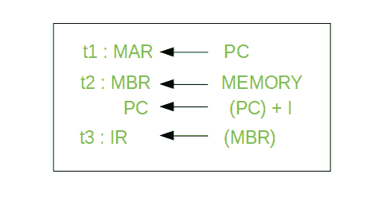

*   Here ‘I’ is the instruction length. The notations (t1, t2, t3) represents successive time units. We assume that a clock is available for timing purposes and it emits regularly spaced clock pulses. Each clock pulse defines a time unit. Thus, all time units are of equal duration. Each micro-operation can be performed within the time of a single time unit. 
    First time unit: Move the contents of the PC to MAR. 
    Second time unit: Move contents of memory location specified by MAR to MBR. Increment content of PC by I. 
    Third time unit: Move contents of MBR to IR. 
    **Note:** Second and third micro-operations both take place during the second time unit. 
*   **The Indirect Cycles –** 

    一旦提取了指令，下一步就是提取源操作数。*源操作数*通过间接寻址获取(可以通过任何[寻址模式](https://www.geeksforgeeks.org/addressing-modes/)获取，这里是通过间接寻址获取)。不需要提取基于寄存器的操作数。一旦操作码被执行，可能需要类似的过程来将结果存储在主存储器中。在*微操作*发生后:-

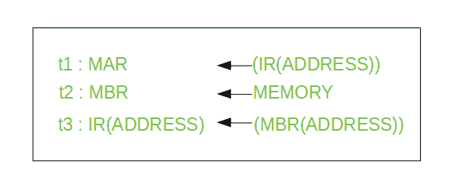

*   Step 1: The address field of the instruction is transferred to the MAR. This is used to fetch the address of the operand. 
    Step 2: The address field of the IR is updated from the MBR.(So that it now contains a direct addressing rather than indirect addressing) 
    Step 3: The IR is now in the state, as if indirect addressing has not been occurred. 

    **注意:**现在 IR 已经为执行周期做好了准备，但是它会跳过该周期一会儿来考虑*中断周期*。

*   **The Execute Cycle** 

    其他三个周期(*提取、间接和中断*)简单且可预测。它们都需要简单、小而固定的微操作顺序。在每种情况下，每次都重复相同的微操作。
    执行周期与他们不同。就像，对于一个有 N 个不同操作码的机器，有 N 个不同的微操作序列可以发生。
    让我们举一个假设的例子:-
    考虑一个加法指令:

*   在这里，该指令将位置 X 的内容添加到寄存器 r 中。相应的微操作将是:-

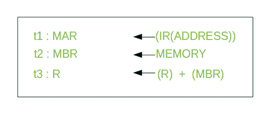

*   We begin with the IR containing the ADD instruction. 
    Step 1: The address portion of IR is loaded into the MAR. 
    Step 2: The address field of the IR is updated from the MBR, so the reference memory location is read. 
    Step 3: Now, the contents of R and MBR are added by the ALU. 

    让我们举一个复杂的例子

*   Here, the content of location X is incremented by 1\. If the result is 0, the next instruction will be skipped. Corresponding sequence of micro-operation will be :- 

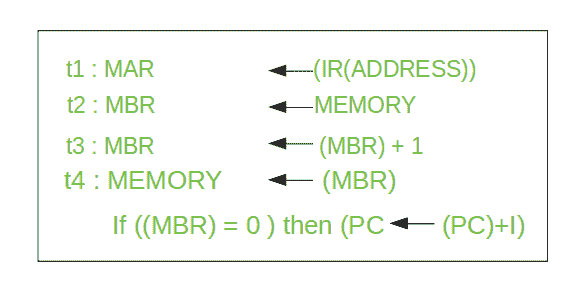

*   Here, the PC is incremented if (MBR) = 0\. This test (is MBR equal to zero or not) and action (PC is incremented by 1) can be implemented as one micro-operation. 
    **Note** : This test and action micro-operation can be performed during the same time unit during which the updated value MBR is stored back to memory. 
*   **中断周期** :
    在执行周期完成时，进行测试以确定是否发生了任何启用的中断。如果发生了使能中断，则发生中断周期。这种循环的性质因机器而异。
    让我们进行一系列微操作:-

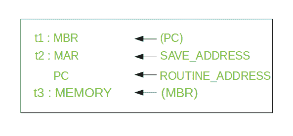

*   Step 1: Contents of the PC is transferred to the MBR, so that they can be saved for return. 
    Step 2: MAR is loaded with the address at which the contents of the PC are to be saved. 
    PC is loaded with the address of the start of the interrupt-processing routine. 
    Step 3: MBR, containing the old value of PC, is stored in memory. 

    **注意:**在步骤 2 中，两个动作作为一个微操作实现。然而，大多数处理器提供多种类型的中断，可能需要一个或多个微操作来获得保存地址和例程地址，然后分别将其传输到 MAR 和 PC。