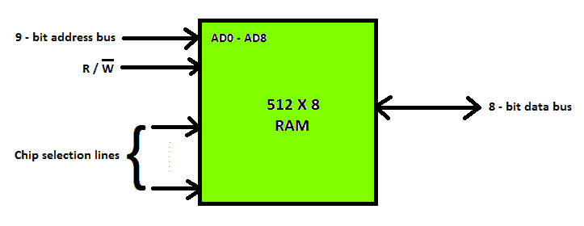
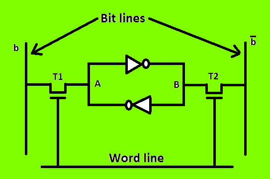
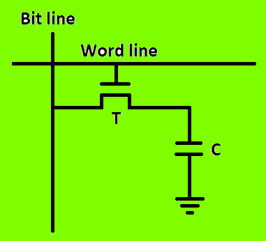

# 不同类型的随机存取存储器

> 原文:[https://www . geesforgeks . org/different-type-ram-random-access-memory/](https://www.geeksforgeeks.org/different-types-ram-random-access-memory/)

随机存取存储器是计算机主存储器的一部分，可由中央处理器直接访问。内存用于读写数据，由中央处理器随机存取。内存本质上是易失性的，这意味着如果断电，存储的信息就会丢失。内存用于存储当前由中央处理器处理的数据。大多数可修改的程序和数据都存储在内存中。

集成内存芯片有两种形式:

1.  静态随机存取存储器
2.  动态随机存取存储器

ram 芯片的框图如下。

**1。静态随机存取存储器:**
静态随机存取存储器由电路组成，只要通电，电路就能保存存储的信息。这意味着这种类型的存储器需要恒定的功率。静态随机存取存储器用于构建高速缓冲存储器。

**静态随机存取存储器存储单元:**静态随机存取存储器(SRAM)是由只要通电就能保持其状态的电路组成的存储器。因此，这种类型的存储器被称为易失性存储器。下图显示了静态随机存取存储器的单元图。锁存器由两个反相器连接而成，如图所示。两个晶体管 T1 和 T2 用于连接锁存器和两条位线。这些晶体管的目的是充当开关，可以在字线的控制下打开或关闭，字线由地址解码器控制。当字线处于 0 电平时，晶体管关闭，锁存器保留其信息。例如，如果 A 点的逻辑值为 1，B 点的逻辑值为 0，则单元处于状态 1。只要字线没有被激活，这种状态就被保持。

对于**读取操作**，字线由输入到地址解码器的地址激活。激活的字线闭合晶体管(开关)T1 和 T2。那么 A 点和 B 点的比特值可以传输到它们各自的位线。位线末端的读出/写入电路将输出发送到处理器。
对于**写操作**，提供给解码器的地址激活字线以闭合两个开关。然后，通过读出/写入电路提供将要写入单元的位值，然后位线中的信号被存储在单元中。

**2。动态随机存取存储器:**
动态随机存取存储器以施加到电容器上的电荷的形式存储二进制信息。电容器上存储的信息往往会在一段时间内丢失，因此电容器必须定期充电以保持其使用状态。主存储器一般由 DRAM 芯片组成。

**DRAM 存储单元:**虽然 SRAM 速度很快，但是价格昂贵，因为它的每个单元都需要几个晶体管。相对便宜的随机存取存储器是动态随机存取存储器，因为每个单元使用一个晶体管和一个电容器，如下图所示。，其中 C 是电容，T 是晶体管。信息以电容器上电荷的形式存储在动态随机存取存储器单元中，这种电荷需要定期充电。
为了在该单元中存储信息，晶体管 T 被导通，并且适当的电压被施加到位线。这导致已知量的电荷存储在电容器中。晶体管关闭后，由于电容器的特性，它开始放电。因此，只有在电容器上的电荷下降到某个阈值以下之前读取存储在单元中的信息，才能正确读取该信息。

**DRAM 的类型:**
DRAM 主要有 5 种类型:

1.  **异步 DRAM(ADRAM)–**
    上述的 DRAM 是异步型 DRAM。存储设备的时序是异步控制的。专用存储器控制器电路产生必要的控制信号来控制时序。中央处理器必须考虑内存响应的延迟。

2.  **同步 DRAM(SDRAM)–**
    这些 RAM 芯片的访问速度直接与 CPU 的时钟同步。为此，当中央处理器希望内存芯片准备就绪时，它们仍然可以运行。这些存储器在中央处理器-存储器总线上运行，而不强加等待状态。软件随机存取存储器在商业上可作为包含多个软件随机存取存储器芯片的模块获得，并形成模块所需的容量。

3.  **双倍数据速率 SDRAM(DDR SDRAM)–**
    这个更快版本的 SDRAM 在时钟信号的两个边沿上执行操作；而标准的软件随机存取存储器在时钟信号的上升沿执行其操作。由于它们在时钟的两个边沿传输数据，数据传输速率提高了一倍。为了高速存取数据，存储单元被组织成两组。每个组都是单独访问的。

4.  **Rambus DRAM(RDRAM)–**
    RDRAM 通过狭窄的 CPU-内存总线提供非常高的数据传输速率。它使用各种加速机制，如同步内存接口、动态随机存取存储器芯片内的缓存和非常快的信号时序。Rambus 数据总线宽度为 8 或 9 位。

5.  **高速缓存 DRAM(CDRAM)–**
    这种内存是一种特殊类型的 DRAM 内存，带有片上高速缓存(SRAM)，作为主 DRAM 的高速缓冲区。

**SRAM 和 DRAM 的区别:**
下表列出了 SRAM 和 DRAM 的一些区别:

