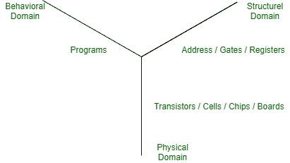
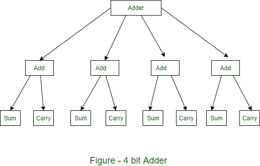

# 数字化设计流程

> 原文:[https://www.geeksforgeeks.org/digital-design-process/](https://www.geeksforgeeks.org/digital-design-process/)

先决条件–[数字系统简介](https://www.geeksforgeeks.org/introduction-to-digital-systems/)

由于当前趋势中计算机辅助设计(CAD)工具的尺寸和复杂性增加，因此在此过程中引入了计算机辅助设计工具。设计师希望规范设计程序，从设计思想出发，实现设计，即所谓的设计流程。

新的计算机辅助设计工具基于硬件描述语言(HDL)来改进过程。HDL 提供了表示各种设计步骤输出的格式。基于高密度脂蛋白的设计自动化(DA)工具将其高密度脂蛋白输入转换为高密度脂蛋白，其中包含更多的硬件信息。

**表示:**

**行为表征:**
它描述了一个特定的设计应该如何响应一组给定的输入。行为可以通过以下方式指定:

*   布尔方程
*   输入和输出值表
*   用标准高级计算机语言或特殊硬件描述语言编写的算法。

n 位加法器是行为表示的一个很好的例子。

**结构表示:**
它指定了组件如何相互连接以执行某个功能或实现指定的硬件。通常，描述是模块及其互连的列表，通常称为网表。

在结构层次上，抽象层次是:

*   模块级
*   门级
*   开关电平

**物理表示:**
在集成电路工艺中，最低级别的物理规格是制造工艺中各种处理步骤所需的光掩模信息。在模块级，4 位加法器的物理布局可以由矩形或多边形定义，该矩形或多边形指定加法器、一组子模块和输入集合的所有几何形状的外部边界。