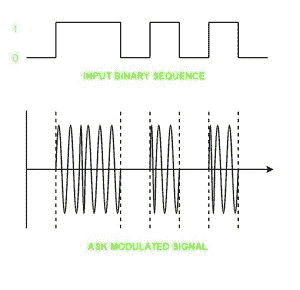
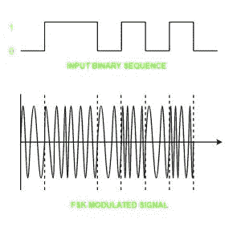
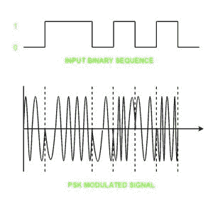

# 数模转换

> 原文:[https://www.geeksforgeeks.org/digital-to-analog-conversion/](https://www.geeksforgeeks.org/digital-to-analog-conversion/)

**数字信号–**数字信号是将数据表示为离散值序列的信号；在任何给定的时间，它只能接受有限数量的值中的一个。

**模拟信号–**模拟信号是任何连续信号，其信号的时变特征是某个其他时变量的表示，即类似于另一个时变信号。

以下技术可用于数模转换:

**1。振幅移位键控–**振幅移位键控是一种载波信号是模拟的，而要调制的数据是数字的技术。模拟载波信号的幅度被修改以反映二进制数据。

当二进制数据表示 0 时，调制后的二进制信号给出零值，而当数据为 1 时，给出载波输出。载波信号的频率和相位保持不变。

**幅移键控的优点–**

*   它可用于通过光纤传输数字数据。
*   接收器和发射器设计简单，成本也相对较低。
*   与 FSK 相比，它使用更少的带宽，因此它提供了更高的带宽效率。

**振幅移位键控的缺点–**

*   它容易受到噪声干扰，因此整个传输可能会丢失。
*   它的功率效率较低。

**2。频移键控–**在这种调制中，模拟载波信号的频率被修改以反映二进制数据。

对于二进制高输入，频移键控调制波的输出频率较高，对于二进制低输入，其输出频率较低。载波信号的幅度和相位保持不变。

**频移键控的优点–**

*   频移键控调制信号有助于避免 ASK 带来的噪声问题。
*   它出错的几率更低。
*   它提供高信噪比。
*   发射机和接收机的实现对于低数据速率应用来说很简单。

**频移键控的缺点–**

*   与 ASK 相比，它使用更大的带宽，因此带宽效率更低。
*   它的功率效率较低。

**3。相移键控–**在这种调制中，模拟载波信号的相位被修改以反映二进制数据。载波信号的幅度和频率保持不变。

它进一步分类如下:

1.  **Binary Phase Shift Keying (BPSK):**
    BPSK also known as phase reversal keying or 2PSK is the simplest form of phase shift keying. The Phase of the carrier wave is changed according to the two binary inputs. In Binary Phase shift keying, difference of 180 phase shift is used between binary 1 and binary 0.

    这被认为是最稳健的数字调制技术，用于长距离无线通信。

2.  **Quadrature phase shift keying:**
    This technique is used to increase the bit rate i.e we can code two bits onto one single element. It uses four phases to encode two bits per symbol. QPSK uses phase shifts of multiples of 90 degrees.

    与 BPSK 相比，它具有双倍数据速率承载能力，因为两个比特被映射在每个星座点上。

**相移键控的优点–**

*   与 ASK 和 FSK 相比，这是一种功率效率更高的调制技术。
*   它出错的几率更低。
*   与 FSK 相比，它允许数据更有效地沿着通信信号传输。

**相移键控的缺点–**

*   它提供低带宽效率。
*   二进制数据的检测和恢复算法非常复杂。
*   这是一个非相干参考信号。

**参考–**
[数模转换器–维基百科](https://en.wikipedia.org/wiki/Digital-to-analog_converter)