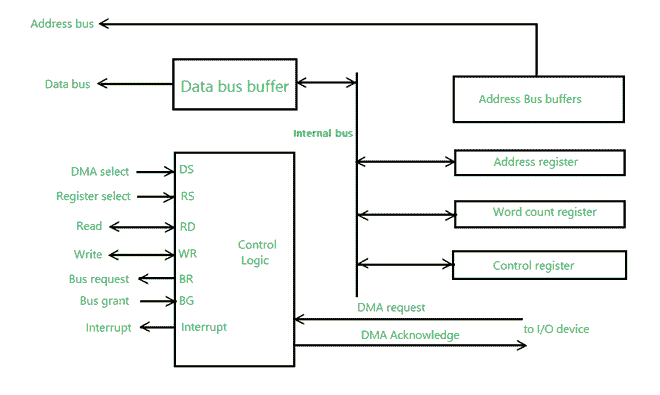

# 计算机体系结构中的直接访问媒体(DMA)控制器

> 原文:[https://www . geesforgeks . org/直接访问-媒体-DMA-计算机中控制器-体系结构/](https://www.geeksforgeeks.org/direct-access-media-dma-controller-in-computer-architecture/)

**直接内存访问(DMA) :**

[DMA](https://www.geeksforgeeks.org/direct-memory-access-with-dma-controller-8257-8237/) 控制器是一种硬件设备，允许 I/O 设备在处理器参与较少的情况下直接访问内存。DMA 控制器需要相同的接口旧电路来与中央处理器和输入/输出设备通信。

下面的图 1 显示了直接存储器存取控制器的框图。该装置通过数据总线和控制线与中央处理器通信。通过使用地址总线并允许直接存储器存取和寄存器选择输入，直接存储器存取中的寄存器由中央处理器选择。研发和 WR 是双向投入。当 BG(总线授权)输入为 0 时，CPU 可以与 DMA 寄存器通信。当 BG(总线授权)输入为 1 时，中央处理器已经放弃总线，直接存储器存取可以直接与存储器通信。

[**DMA 控制器寄存器**](https://www.geeksforgeeks.org/internal-registers-of-dma-controller/) **:**

DMA 控制器有三个寄存器，如下所示。

*   **地址寄存器–**它包含指定存储器中所需位置的地址。
*   **字数统计寄存器–**包含要传输的字数。
*   **控制寄存器–**指定传输模式。

**注–**

对于 [CPU](https://www.geeksforgeeks.org/difference-between-cpu-and-gpu/) 来说，DMA 中的所有寄存器都是输入/输出接口寄存器。因此，在程序控制下，中央处理器可以通过数据总线读写直接存储器存取寄存器。

图 1-框图

**说明:**

中央处理器通过[数据总线](https://www.geeksforgeeks.org/introduction-of-alu-and-data-path/)发送给定信息，初始化 DMA。

*   数据可用(可读取)或数据存储(可写入)的存储块的起始地址。
*   它还发送字数，即内存块中要读取或写入的字数。
*   控件来定义读取或写入等传输模式。
*   开始直接存储器存取传输的一种控制。