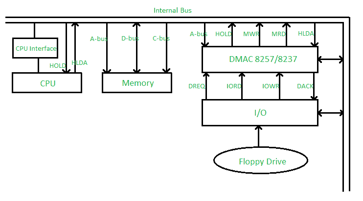
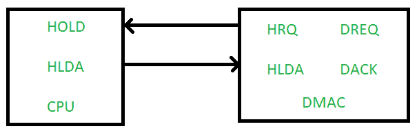

# 用 DMA 控制器 8257/8237 直接内存访问

> 原文:[https://www . geesforgeks . org/直接内存访问带 dma 控制器-8257-8237/](https://www.geeksforgeeks.org/direct-memory-access-with-dma-controller-8257-8237/)

假设任何连接在输入输出端口的设备想要传输数据到内存，首先它会发送输入输出端口地址和控制信号，输入输出读取到输入输出端口，然后它会发送内存地址和内存写入信号到需要传输数据的内存。在正常的输入输出技术中，处理器忙于检查下一个输入输出操作是否完成，因此这种技术很慢。

通过实现直接存储器存取技术，避免了输入输出端口和存储器之间或两个存储器之间数据传输缓慢的问题。由于微处理器/计算机被绕过，地址总线和数据总线的控制交给了直接存储器存取控制器，因此速度更快。

*   保持–保持信号

*   HLDA–保持确认

*   DREQ–DMA 请求

*   DACK–DMA 确认

假设连接在输入输出端口的软驱想要将数据传输到内存，执行以下步骤:

*   **Step-1:** First of all the floppy drive will send DMA request (DREQ) to the DMAC, it means the floppy drive wants its DMA service. 
*   **Step-2:** Now the DMAC will send HOLD signal to the CPU. 
*   **Step-3:** After accepting the DMA service request from the DMAC, the CPU will send hold acknowledgement (HLDA) to the DMAC, it means the microprocessor has released control of the address bus the data bus to DMAC and the microprocessor/computer is bypassed during DMA service. 
*   **Step-4:** Now the DMAC will send one acknowledgement (DACL) to the floppy drive e=which is connected at the input-output port. It means the DMAC tells the floppy drive be ready for its DMA service. 
*   **步骤-5:** 现在在输入输出读和存储器写信号的帮助下，数据从软盘驱动器传输到存储器。

**DMAC 的模式:**

1.  **Single Mode –** In this only one channel is used, means only a single DMAC is connected to the bus system. 

2.  **Cascade Mode –** In this multiple channels are used, we can further cascade more number of DMACs. 

