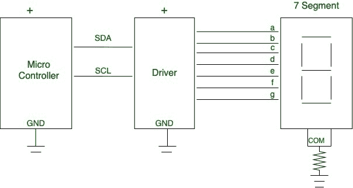
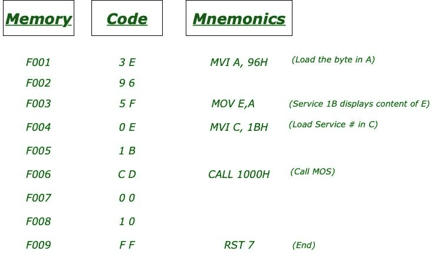

# 使用引物

在系统七段发光二极管上显示结果

> 原文:[https://www . geesforgeks . org/display-result-at-system-segment-LEDs-use-primer/](https://www.geeksforgeeks.org/display-result-at-system-seven-segment-leds-using-primer/)

****初级程序**的监控操作系统(MOS)** 可用于通过使用监控程序的适当例程调用，以十六进制或二进制显示程序结果。底漆由 **8279** 键盘或显示器等可编程接口设备管理。

七段发光二极管连接使用多路复用技术。不能通过编写 MOS 提供的子程序服务直接访问。

必须牢记以下几点:

1.  **MOS** 包括 36 个服务例程，用户只需将服务号码加载到寄存器 **C** 中即可调用。
2.  《入门手册》包含用户可使用的所有上述子程序。
3.  例如，要用寄存器 **E** 中存储的十六进制字节显示用户 LED 端口累加器中的 **96H** ，我们需要调用服务 **1BH。**



<center>**Figure –** Seven Segment Interface</center>

```
F001   3E   MVI A, 96H
F002   96
F003   5F   MOV E, A
F004   0E   MVI C, 1BH
F005   1B
F006   CD   CALL 1000H
F007   00
F008   10
F009   FF   RST 7 
```

以下说明可以修改如下:



<center>**Figure –** Instruction Summary</center>

您需要在位置 **F001H** 输入上述代码，然后执行代码。该代码将在七段显示的数据字段中显示所需的 **96H** 。