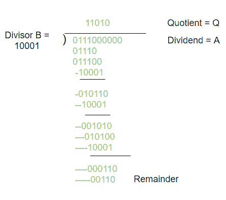
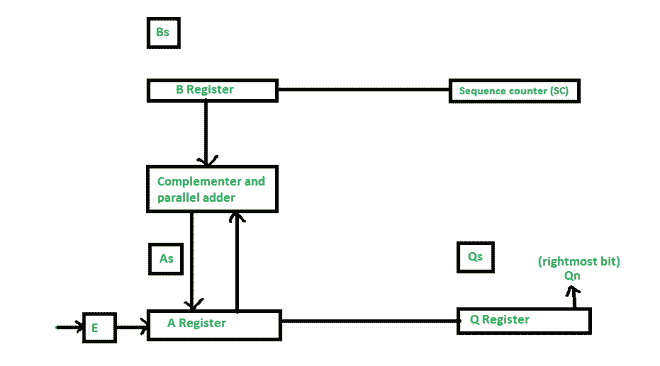
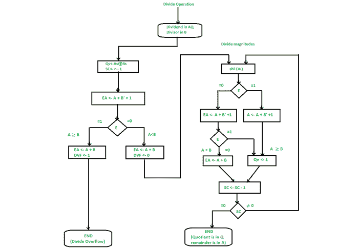
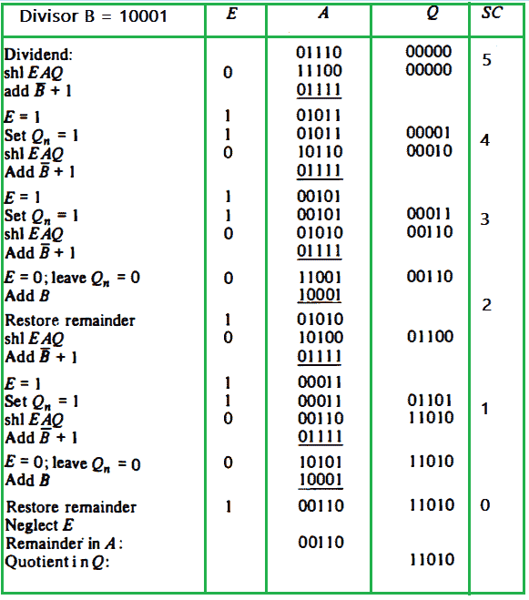

# 符号幅度表示中的除法算法

> 原文:[https://www . geeksforgeeks . org/除法-带符号算法-幅度-表示/](https://www.geeksforgeeks.org/division-algorithm-in-signed-magnitude-representation/)

符号幅度表示法中两个定点二进制数的除法是通过连续的比较、移位和减法运算循环来完成的。

二进制除法比十进制除法容易，因为商位不是 0 就是 1。此外，不需要估计被除数或部分余数调整到除数的次数。

**硬件实现:**

除法运算中的硬件实现与乘法运算所需的硬件实现相同，由以下组件组成–

*   这里，寄存器 B 用于存储除数，双倍长被除数存储在寄存器 A 和 Q 中
*   e 中给出了相对大小的信息
*   序列计数器寄存器(SC)用于存储被除数的位数。

**分部流程图:**

*   最初，被除数在 A & Q，除数在 B.

*   结果的符号被转换成 Q，成为商的一部分。然后在 SC 中设置一个常数来指定商的位数。

*   由于操作数必须与其符号一起保存，因此该字的一个位将被符号占据，并且幅度将由 n -1 位组成。

*   通过从存储在 A 中的被除数的一半比特中减去 B 中的除数来检查除溢出的条件。如果 A ≥ B，则设置 DVF，并且操作在时间之前终止。如果 A < B, no overflow condition occurs and so the value of the dividend is reinstated by adding B to A.

*   幅度的划分从 AQ 的 shl 被除数开始，在移入 E 的高阶位中向左移动
    (注意–如果移入 E 的一个位等于 1，我们知道 EA > B，因为 EA 包括 1 后跟 n -1 位，而 B 只包括 n -1 位)。在这种情况下，必须从 EA 中减去 B，对于商位，应该在 Q 中插入 1。

*   如果左移操作(shl)在 E 中插入一个 0，则通过将除数的 2 的补码值相加来减去除数，并将进位移入 E。如果 E = 1，则意味着 A≥B；因此，Q 被设置为 1。如果 E = 0，则表示 A < B and the original number is reimposed by adding B into A.

*   现在，用包含部分余数的寄存器 A 重复这个过程。

**使用数字硬件的** **二进制除法示例:**

除数 B = 10001，被除数 A = 011100000

**最终余数:** 00110