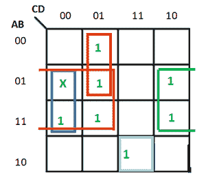
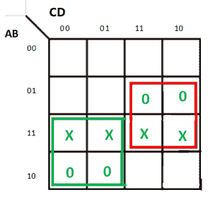
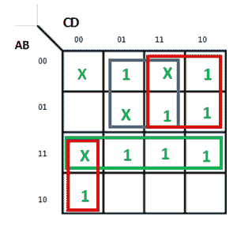

# 不在乎 k 线图中的(X)条件

> 原文:[https://www . geesforgeks . org/don-care-x-conditions-in-k-maps/](https://www.geeksforgeeks.org/dont-care-x-conditions-in-k-maps/)

在使用 K-Map 简化输出表达式时，一个非常重要和有用的概念是“不在乎”的概念。“不关心”条件允许我们替换一个 [K-Map](https://www.geeksforgeeks.org/k-mapkarnaugh-map/) 的空单元格，形成一个变量分组，这个分组比形成没有不关心的组要大。在形成单元组时，我们可以将“不关心”单元视为 1 或 0，或者我们也可以忽略该单元。因此，“不在意”状态可以帮助我们形成更大的细胞群。

在代表无效组合的 K-map 中，一个无关单元格可以用一个叉号(X)或减号(-)或φ(φ)来表示。例如，在超额-3 代码系统中，状态 0000、0001、0010、1101、1110 和 1111 无效或未指定。这些状态叫做不在意。

一个标准的具有不在意的 SOP 函数可以通过保持不在意不变，并将 SOP 表单缺失的最小项写成 POS 表单的最大项来转换成 POS 表达式。类似地，具有不关心的 POS 函数可以被转换成 SOP 形式，保持不关心，并将 POS 表达式中缺少的最大项作为 SOP 表达式的最小项。

**示例-1:**
使用 K-map 以标准操作程序的最小形式最小化以下功能:

```
f = m(1, 5, 6, 11, 12, 13, 14) + d(4) 
```

**解释:**
给定表达式的 SOP K 图为:



因此，SOP 最小，

```
f = BC' + BCD' + A'C'D + AB'CD
```

**示例-2:**
使用 K-map 以 POS 最小形式最小化以下功能:

```
F(A, B, C, D) = m(0, 1, 2, 3, 4, 5) + d(10, 11, 12, 13, 14, 15) 
```

**解释:**
用 POS 形式写出给定的表达式:

```
F(A, B, C, D) = M(6, 7, 8, 9) + d(12, 13, 14, 15) 
```

给定表达式的位置 K 图为:



因此，POS 是最小的，

```
F = (A'+ C)(B' + C') 
```

**示例-3:**
使用 K-map 以 SOP 最小形式最小化以下函数:
F(A，B，C，D) = m(1，2，6，7，8，13，14，15) + d(0，3，5，12)

**解释:**
给定表达式的 SOP K 图为:



因此，

```
f = AC'D' + A'D + A'C + AB 
```

**不在意条件的意义:**
不在意条件在数字电路设计中具有以下意义:

1.  **输出的简化:**
    这些条件表示对于给定的数字电路无效的输入。因此，它们可以用来进一步简化数字电路的布尔输出表达式。

2.  **所需门的数量减少:**
    表达式的简化减少了用于实现给定表达式的门的数量。因此，不要在意使数字电路设计更经济。

3.  **降低功耗:**
    将长项分组时，不要在意会减少状态的切换。这减少了表示给定数字电路所需的存储空间，从而降低了功耗。

4.  **表示代码转换器中的无效状态:**
    这些在代码转换器中使用。例如，在 4 位 BCD-到 XS-3 码转换器的设计中，输入组合 1010、1011、1100、1101、1110 和 1111 是无关紧要的。

5.  **预防数字电路中的危险:**
    不在意也能预防数字系统中的危险。