# 数字逻辑中的编码器

> 原文:[https://www.geeksforgeeks.org/encoder-in-digital-logic/](https://www.geeksforgeeks.org/encoder-in-digital-logic/)

编码器是一个**组合电路**，执行与解码器相反的操作。它最多有**条 2^n 输入线**和**‘n’条输出线**,因此它将来自 2^n 输入的信息编码成 n 位代码。它将产生一个相当于输入的二进制代码，该代码为高电平有效。因此，编码器用“n”位编码 2^n 输入线。


### 4 : 2 编码器–

4 对 2 编码器由**四个输入 Y3、Y2、Y1 & Y0 和两个输出 A1 & A0** 组成。在任何时候，这 4 个输入中只有一个可以是“1”，以便在输出端获得相应的二进制代码。下图显示了 4 对 2 编码器的逻辑符号:

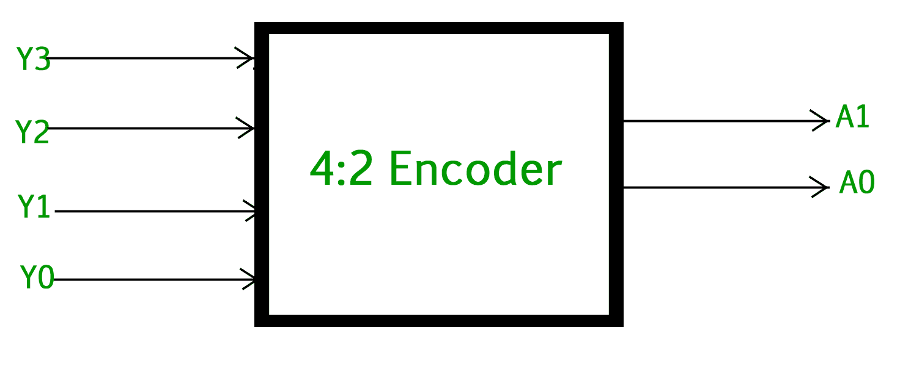

4 到 2 编码器的真值表如下:

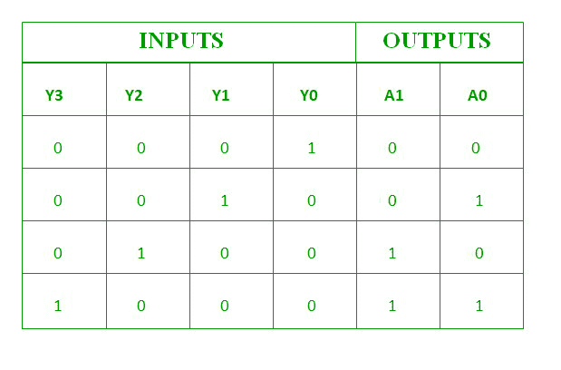

**A1 和 A0 的逻辑表达式:**

```
A1 = Y3 + Y2
A0 = Y3 + Y1

```

上述两个布尔函数 A1 和 A0 可以使用两个输入或门来实现:

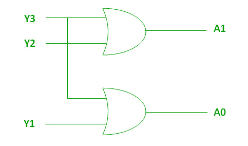

### 8 : 3 编码器(八进制到二进制)–

8 对 3 编码器或八进制到二进制编码器由 **8 个输入** : Y7 到 Y0 和 **3 个输出** : A2、A1 & A0 组成。每条输入线对应一个八进制数字，三个输出产生相应的二进制代码。

下图显示了八进制到二进制编码器的逻辑符号:

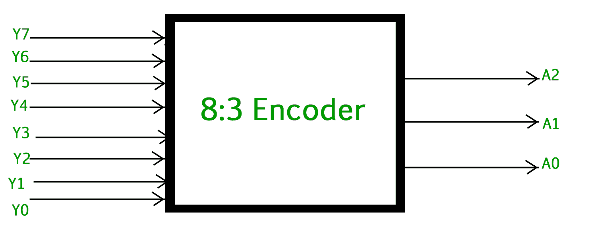

8 至 3 编码器的真值表如下:

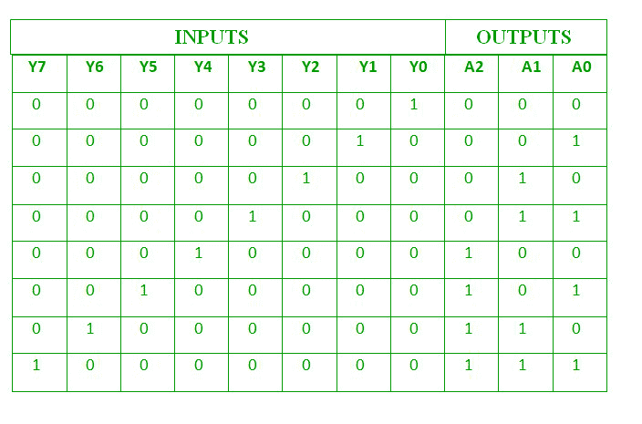

**A2、A1 和 A0 的逻辑表达式:**

```
A2 = Y7 + Y6 + Y5 + Y4
A1 = Y7 + Y6 + Y3 + Y2
A0 = Y7 + Y5 + Y3 + Y1

```

上述两个布尔函数 A2、A1 和 A0 可以使用四个输入或门来实现:

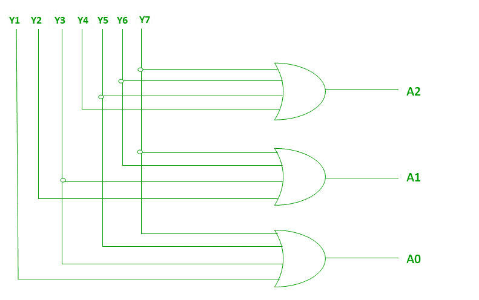

### 十进制到 BCD 编码器–

十进制到二进制编码器通常由 **10 条输入线**和 **4 条输出线**组成。每条输入线对应于每一个十进制数字，4 个输出对应于 BCD 码。该编码器接受解码的十进制数据作为输入，并将其编码为输出线路上可用的 BCD 输出。下图显示了十进制到 BCD 编码器的逻辑符号:

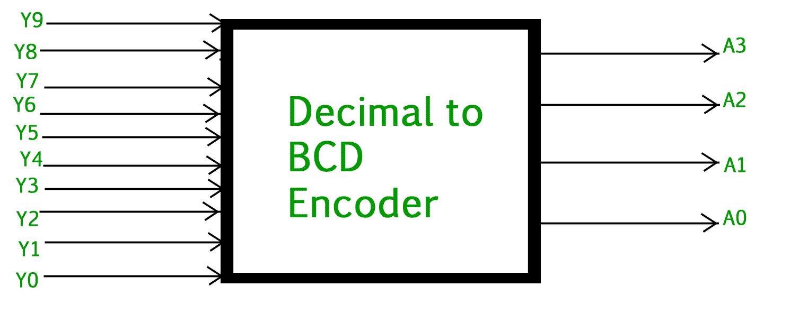

十进制到 BCD 编码器的真值表如下:


**A3、A2、A1 和 A0 的逻辑表达式:**

```
 A3 = Y9 + Y8
 A2 = Y7 + Y6 + Y5 +Y4
 A1 = Y7 + Y6 + Y3 +Y2
 A0 = Y9 + Y7 +Y5 +Y3 + Y1

```

以上两个布尔函数可以使用或门来实现:

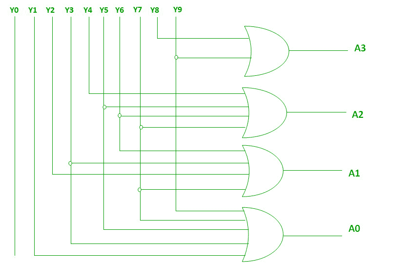

### 优先级编码器–

4 对 2 优先级编码器有 **4 个输入** : Y3、Y2、Y1 & Y0 和 **2 个输出** : A1 & A0。这里，输入 Y3 具有**最高优先级**，而输入 Y0 具有**最低优先级**。在这种情况下，即使多个输入同时为‘1’，输出也将是与输入对应的(二进制)码，具有**更高的优先级**。

优先级编码器的真值表如下:

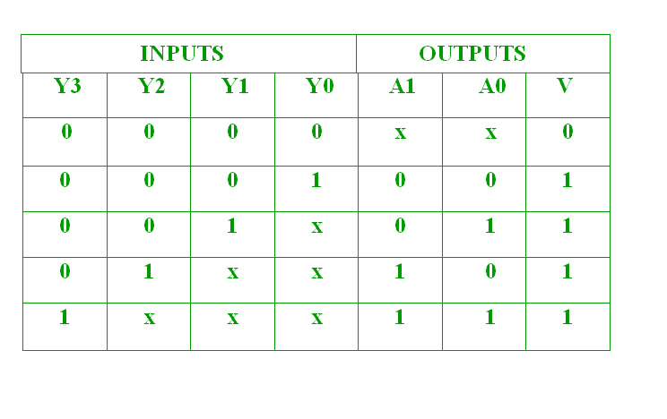

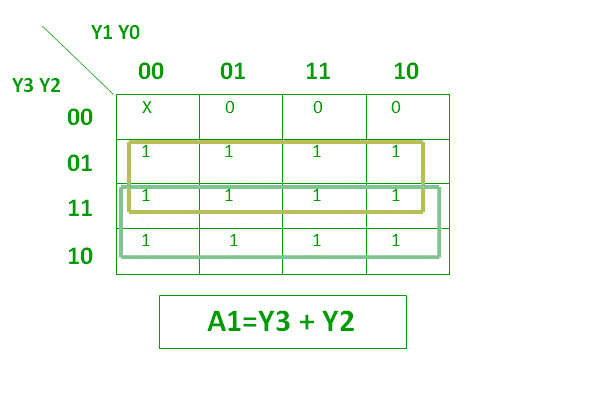

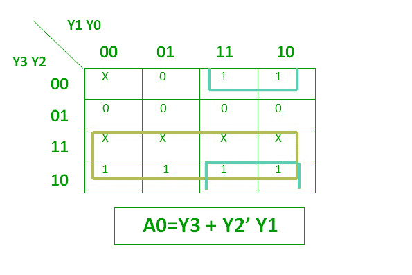

以上两个布尔函数可以实现为:

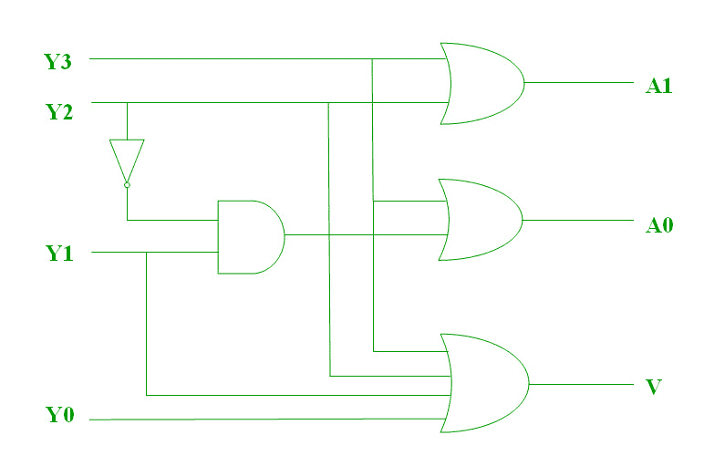

**普通编码器的缺点–**

1.  当编码器的所有输出都等于零时，就会出现模糊。
2.  如果多个输入为高电平有效，则编码器产生一个输出，该输出可能不是正确的代码。

因此，为了克服这些困难，我们应该给编码器的每个输入分配优先级。然后，编码器的输出将是(对应于高电平有效输入的代码，具有更高的优先级。

**编码器的使用–**

1.  编码器是所有数字系统中非常常见的电子电路。
2.  编码器用于将十进制值转换为二进制值，以执行二进制功能，如加法、减法、乘法等。
3.  其他应用，尤其是优先级编码器，可能包括检测微处理器应用中的中断。

**GATE CS 角题**

练习下列问题将帮助你测试你的知识。所有的问题在前几年的 GATE 考试或 GATE 模拟考试中都被问过。强烈建议你练习一下。

1.  [GATE CS 2013，第 65 题](https://www.geeksforgeeks.org/gate-gate-cs-2013-question-5/)
2.  [GATE CS 2014(第三集)，第 65 题](https://www.geeksforgeeks.org/gate-gate-cs-2014-set-3-question-18/)

**参考资料–**
[编码器–维基百科](https://en.wikipedia.org/wiki/Encoder_(digital))
[优先编码器–维基百科](https://en.wikipedia.org/wiki/Priority_encoder)

本文由 **Harshita Pandey** 供稿。如果你喜欢 GeeksforGeeks 并想投稿，你也可以使用[contribute.geeksforgeeks.org](http://www.contribute.geeksforgeeks.org)写一篇文章或者把你的文章邮寄到 contribute@geeksforgeeks.org。看到你的文章出现在极客博客主页上，帮助其他极客。

如果你发现任何不正确的地方，或者你想分享更多关于上面讨论的话题的信息，请写评论。