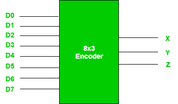
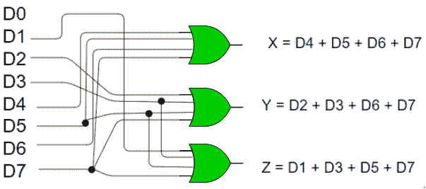
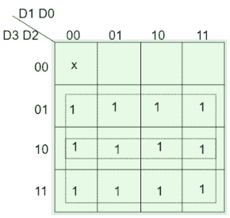
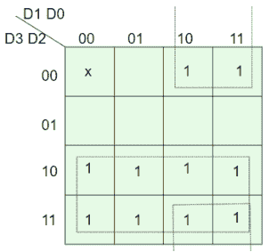
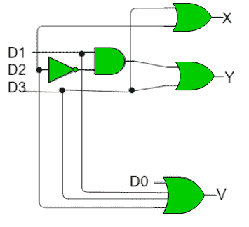
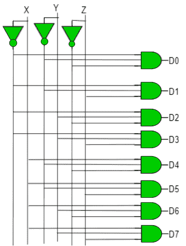

# 数字逻辑中的编码器和解码器

> 原文:[https://www . geesforgeks . org/数字逻辑中的编码器和解码器/](https://www.geeksforgeeks.org/encoders-and-decoders-in-digital-logic/)

先决条件–[编码器](https://www.geeksforgeeks.org/digital-logic-encoder/)、[解码器](https://www.geeksforgeeks.org/digital-logic-binary-decoder/)

N 位二进制码可用于存储编码信息的 2 <sup>N</sup> 个不同元素。这就是编码器和解码器的用途。**编码器**将 2 <sup>N</sup> 行输入转换为 N 位代码，**解码器**将 N 位解码为 2 <sup>N</sup> 行。

**1。编码器–**
编码器是一种组合电路，它将 2 <sup>N</sup> 输入线形式的二进制信息转换成 N 条输出线，这些输出线代表输入的 N 位代码。对于简单编码器，假设一次只有一条输入线有效。

举个例子，让我们考虑一下**八进制到二进制**编码器。如下图所示，八进制到二进制编码器采用 8 条输入线，产生 3 条输出线。



**真值表–**

| D7 | D6 | D5 | D4 | D3 | D2 | D1 | D0 | X | Y | Z |
| --- | --- | --- | --- | --- | --- | --- | --- | --- | --- | --- |
| Zero | Zero | Zero | Zero | Zero | Zero | Zero | one | Zero | Zero | Zero |
| Zero | Zero | Zero | Zero | Zero | Zero | one | Zero | Zero | Zero | one |
| Zero | Zero | Zero | Zero | Zero | one | Zero | Zero | Zero | one | Zero |
| Zero | Zero | Zero | Zero | one | Zero | Zero | Zero | Zero | one | one |
| Zero | Zero | Zero | one | Zero | Zero | Zero | Zero | one | Zero | Zero |
| Zero | Zero | one | Zero | Zero | Zero | Zero | Zero | one | Zero | one |
| Zero | one | Zero | Zero | Zero | Zero | Zero | Zero | one | one | Zero |
| one | Zero | Zero | Zero | Zero | Zero | Zero | Zero | one | one | one |

从真值表可以看出，D0 激活时输出为 000；001 当 D1 活跃时；010 什么时候活跃等等。

**实现–**
从真值表来看，当输入的八进制数字是 1、3、5 或 7 时，输出线 Z 是活动的。同样，当输入八进制数字为 2、3、6 或 7 时，Y 为 1，当输入八进制数字 4、5、6 或 7 时，X 为 1。因此，布尔函数将是:

```
X = D4 + D5 + D6 + D7
Y = D2 +D3 + D6 + D7
Z = D1 + D3 + D5 + D7 
```

因此，编码器可以用或门实现，如下所示:



这种编码器的一个限制是在任何给定时间只能有一个输入有效。如果多个输入有效，则输出未定义。例如，如果 D6 和 D3 都是活动的，那么我们的输出将是 111，这是 D7 的输出。为了克服这一点，我们使用优先级编码器。

当所有输入都为 0 时，会出现另一个模糊性。在这种情况下，编码器输出 000，这实际上是 D0 有效的输出。为了避免这种情况，可以在输出端增加一个额外的位，称为有效位，当所有输入为 0 和 1 时，该位为 0。

**优先级编码器–**
优先级编码器是一种输入被赋予优先级的编码器电路。当多个输入同时处于活动状态时，优先级较高的输入优先，并生成与之对应的输出。

让我们以 4 比 2 优先级编码器为例。
从真值表可以看出，当所有输入都为 0 时，我们的 V 位或有效位为零，不使用输出。表中的 x 表示无关条件，即它可以是 0 或 1。这里，D3 具有最高优先级，因此，无论其他输入是什么，当 D3 为高时，输出必须是 11。D0 的优先级最低，因此只有当 D0 为高电平而其他输入线为低电平时，输出才会为 00。同样，D2 的优先级高于 D1 和 D0，但低于 D3，因此只有当 D2 为高、D3 为低时，输出才会为 010(D0&D1 不在乎)。

**真值表–**

| D3 | D2 | D1 | D0 | X | Y | V |
| --- | --- | --- | --- | --- | --- | --- |
| Zero | Zero | Zero | Zero | x | x | Zero |
| Zero | Zero | Zero | one | Zero | Zero | one |
| Zero | Zero | one | x | Zero | one | one |
| Zero | one | x | x | one | Zero | one |
| one | x | x | x | one | one | one |

**实现–**
可以清楚地看到，有效位为 1 的条件是至少任何一个输入应为高电平。因此，

```
V = D0 + D1 + D2 + D3 
```

对于 X:



=> X = D2 + D3
对于 Y:



= > Y = D1·D2 '+D3

因此，优先级 4 比 2 编码器可以如下实现:



**2。解码器–**
解码器的工作与编码器相反。它是一个组合电路，将 n 行输入转换为 2 <sup>n</sup> 行输出。

让我们举一个 3 到 8 行解码器的例子。

**真值表–**

| X | Y | Z | D0 | D1 | D2 | D3 | D4 | D5 | D6 | D7 |
| --- | --- | --- | --- | --- | --- | --- | --- | --- | --- | --- |
| Zero | Zero | Zero | one | Zero | Zero | Zero | Zero | Zero | Zero | Zero |
| Zero | Zero | one | Zero | one | Zero | Zero | Zero | Zero | Zero | Zero |
| Zero | one | Zero | Zero | Zero | one | Zero | Zero | Zero | Zero | Zero |
| Zero | one | one | Zero | Zero | Zero | one | Zero | Zero | Zero | Zero |
| one | Zero | Zero | Zero | Zero | Zero | Zero | one | Zero | Zero | Zero |
| one | Zero | one | Zero | Zero | Zero | Zero | Zero | one | Zero | Zero |
| one | one | Zero | Zero | Zero | Zero | Zero | Zero | Zero | one | Zero |
| one | one | one | Zero | Zero | Zero | Zero | Zero | Zero | Zero | one |

**实现–**
当 X = 0，Y = 0，Z = 0 时，D0 为高。因此，

```
D0 = X’ Y’ Z’ 
```

同样的，

```
D1 = X’ Y’ Z
D2 = X’ Y Z’
D3 = X’ Y Z
D4 = X Y’ Z’
D5 = X Y’ Z
D6 = X Y Z’
D7 = X Y Z 
```

因此，

