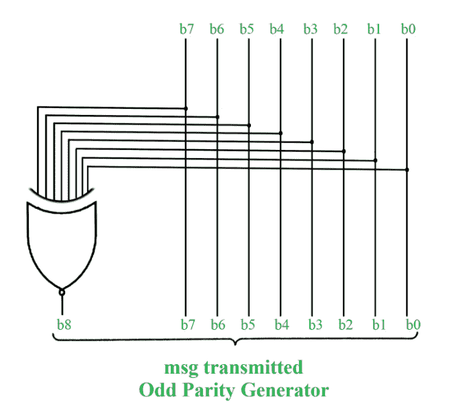
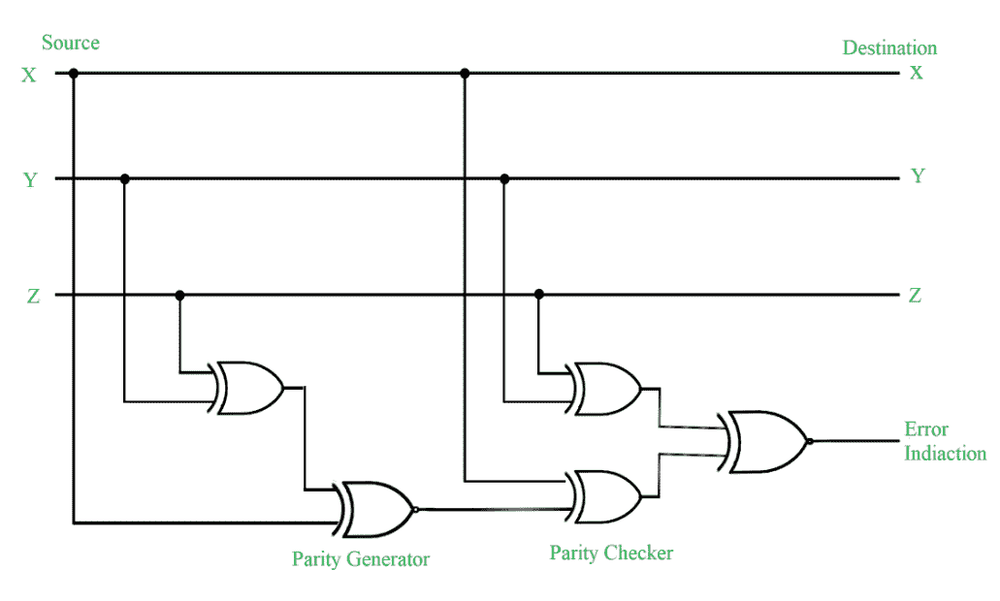

# 检错码:奇偶校验位法

> 原文:[https://www . geesforgeks . org/错误检测-代码-奇偶校验位-方法/](https://www.geeksforgeeks.org/error-detection-codes-parity-bit-method/)

**检错码:**
二进制信息通过某种通信媒介从一个位置传送到另一个位置。外部噪声可以将位从 1 变为 0 或从 0 变为 1。这种数值的变化称为误差。为了有效的数据传输，应该有一个错误检测和纠正代码。检错码是一种二进制码，用于在传输过程中检测数字错误。一个著名的错误检测代码是奇偶校验位方法。

**奇偶校验位方法:**
奇偶校验位是包含在二进制消息中的一个额外的位，使 1 的总数为奇数或偶数。奇偶校验字表示二进制字符串中 1 的数量。奇偶系统有两种——偶数和奇数。在偶数奇偶校验系统中，1 被附加到二进制串中，串中有奇数个 1，否则附加 0 使 1 的总数为偶数。

在奇数奇偶校验系统中，如果有偶数个 1，则 1 被附加到二进制字符串中，以形成奇数个 1。接收方知道发送方是奇数奇偶校验生成器还是偶数奇偶校验生成器。假设发送方是一个奇数奇偶校验生成器，那么接收到的二进制字符串中一定有奇数个 1。如果单个位发生错误，即位被更改为 1 到 0 或 0 到 1，则接收到的二进制位将具有偶数个 1，这将指示错误。

这种方法的局限性在于，只能识别单个位中的错误。

| 信息(XYZ) | p(奇数) | p(偶数) |
| 000 | one | Zero |
| 001 | Zero | one |
| 010 | Zero | one |
| 011 | one | Zero |
| One hundred | Zero | one |
| One hundred and one | one | Zero |
| One hundred and ten | one | Zero |
| One hundred and eleven | Zero | one |

**Figure –** Error Detection with Odd Parity Bit

**要记住的点:**

*   在 1 的补码中，有符号数+0 和-0 有两种不同的表示。
*   8 位数字的符号幅度表示范围，其中 1 位用作符号位，如下所示-2 7 到+2 7 。
*   [如果尾数的最高有效位为 1，则称浮点数](https://www.geeksforgeeks.org/floating-point-representation-basics/)为规格化。例如，6 位二进制数 001101 由于两个前导 0 而被归一化。
*   [布斯算法](https://www.geeksforgeeks.org/computer-organization-booths-algorithm/)使用两个 n 比特数进行乘法运算，给出 2n 比特的结果。
*   布斯算法使用数字的 2 的补码表示，对正数和负数都有效。
*   如果使用 k 位表示指数，则位数= (2 k-1 )和指数范围=–(2k-1-1)至(2 k -1)。