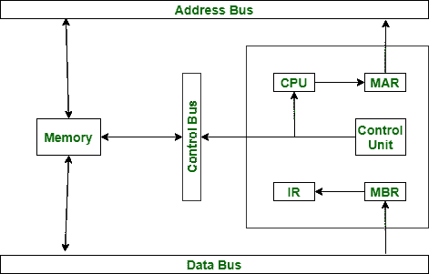

# 指令执行的基本寄存器

> 原文:[https://www . geesforgeks . org/essential-registers-for-instruction-execution/](https://www.geeksforgeeks.org/essential-registers-for-instruction-execution/)

这些是执行指令所需的各种寄存器:程序计数器、指令寄存器、内存缓冲(或数据)寄存器和内存地址寄存器。

这些解释如下。

1.  **Program Counter (PC) :**
    It contains the address of an instruction to be executed next. The PC is updated by the CPU after each instruction executed so that it always points to the next instruction to be executed. A branch or skip instruction will also modify the content of the PC.
2.  **Instruction Register (IR) :**
    it contains the instruction most recently fetched or executed. The fetched instruction is loaded into an IR, where the opcode and operand specifier are analysed.
3.  **Memory Buffer (or Data) Register (MBR or MDR) :**
    it contains a word of data to be written to memory are the words most recently read. Contents of MBR are directly connected to the data bus.
4.  **存储器地址寄存器(MAR) :**
    它包含主存储器位置的地址，为了存储信息，必须从该位置获取信息。MAR 的内容直接连接到地址总线。

除了这些寄存器，我们还可以使用用户看不到的其他寄存器，例如临时缓冲寄存器。