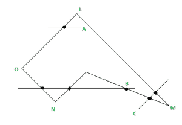
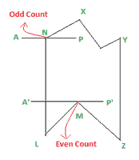
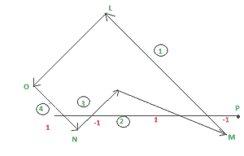

# 偶数奇数法&绕组编号法-多边形的内部&外部测试

> 原文:[https://www . geesforgeks . org/偶数-奇数-方法-缠绕-编号-方法-多边形内外测试/](https://www.geeksforgeeks.org/even-odd-method-winding-number-method-inside-outside-test-of-a-polygon/)

**简介:**
一个多边形可以表示为若干相连的线段，从一个封闭的图形首尾相连。
多边形可以通过两种方式表示–
(I)使用移动命令勾勒轮廓和
(ii)通过将多边形内部的像素设置为高(包括边界上的像素)来作为实体对象。

要确定一个点是否位于多边形内部，在计算机图形学中，我们有两种方法:
(a)奇偶法(奇偶性法则)
(b)缠绕数法-内部

**奇偶法:**
在待检测点(P)和多边形外的已知点之间构建线段是确定一个点是否位于多边形内的一种方法。然后计算线段与多边形边界相交的次数。如果与这条线相交的多边形边的数量是奇数，则点(P)是一个内点；否则，该点是外部点。

在图中，从“A”开始的线段穿过单条边&因此点 A 在多边形内部。点 B 也在多边形内部，因为从 B 开始的线段穿过三条(奇数)边。但是点 C 在多边形的外面，因为点 C 的线段穿过两条(偶数)边。

多边形

*但是当交点为顶点时，这个奇偶检验失败。*
处理这个案子，我们要做的修改不多。
我们必须看多边形的两个线段在这个顶点相交的另一个端点。如果这些点位于构造线 A'P '的同一侧，则交点计为偶数个交点。但是，如果它们位于构造线 AP 的相对侧，则交点算作单个交点。

多边形

如我们所见，线段 A‘p’在 M 处相交，M 是一个顶点，L & Z 是在 M 处相交的两个线段的另一个端点。L & Z 位于线段 A‘p 的同一侧，因此计数被视为偶数。

**缠绕编号法:**
定义多边形内点的另一种方法叫做缠绕编号法。从概念上讲，可以在要检查的点(P)和多边形边界上的点之间拉伸一条弹性线。
这样处理，松紧带系在要检查的点(P)上，松紧带的另一端沿着多边形的边界滑动，直到形成一个完整的回路。然后我们检查弹性线绕过交点多少次。如果它至少缠绕一次，那么点就在里面。如果没有净绕组，那么点在外面。

在这种方法中，我们给每一条穿过的边界线一个方向号，并把这些方向号相加，而不仅仅是计算交点。方向号表示多边形边缘相对于我们为测试构建的线段绘制的方向。

例如:为了测试一个点(x i ，y i ，让我们考虑一个水平线段 y = y i ，它从多边形外部延伸到(x i ，y i )。我们找到了所有穿过这条线段的边。
现在侧边有 2 种交叉方式，侧边可以从端点以下开始画，穿过它，端点在线上。在这种情况下，我们可以给侧边指定方向号–1，或者边可以从线上方开始&到线下方结束，在这种情况下，给定方向 1。穿过构造的水平线段的边的方向数的总和产生该点的“缠绕数”。

如果缠绕数非零，则该点在多边形内部，否则在多边形外部。

多边形

在上图中，线段穿过 4 条方向号不同的边:1，-1，1& -1，然后:
缠绕号= 1 + (-1) + 1 + (-1) = 0
所以点 P 在多边形外。边缘的方向为-1，因为它开始于线段下方&结束于线段上方。同样，边有方向号+1，因为它从线段上方开始&到线段下方结束(见图中方向)。