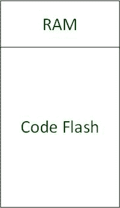

# 在嵌入式系统中从内存执行

> 原文:[https://www . geeksforgeeks . org/execution-from-in-ram-in-embedded-system/](https://www.geeksforgeeks.org/execution-from-ram-in-embedded-systems/)

**先决条件:** [随机存取存储器(RAM)](https://www.geeksforgeeks.org/random-access-memory-ram/)[嵌入式系统简介](https://www.geeksforgeeks.org/introduction-of-embedded-systems-set-1/)

**简介:**
与计算机中的应用程序不同，嵌入式系统中的软件不从 RAM 中执行。在绝大多数现代嵌入式系统架构中，程序(指令)存储在微控制器的闪存(代码闪存/程序闪存)中，并直接就地执行。早期，只读存储器用于程序存储和执行。
由于存储设备中的新兴技术，如今闪存正在被使用。随机存取存储器是易失性存储器，在复位或电源循环时不包含任何内容。它用于在运行时存储数据和保存变量值。通过在代码闪存中存储和执行程序(使用下载工具和调试器)，可以安全地开发嵌入式产品。微控制器有专门用于代码闪存和随机存取存储器的存储空间。高级微控制器中的内存映射包括数据闪存、DSPR、PSPR、引导只读存储器、EEPROM、调试内存等。为了简单起见，我们将考虑代码闪存来存储和执行程序，内存来存储变量和数据。在某些情况下，必须从内存中运行子程序。
本文涵盖了将代码段复制到 RAM 的必要性、实现它的各种方法及其优缺点。复制到内存意味着托管两个代码副本—一个在闪存中，另一个在内存中。



图 1 .微控制器的存储器映射

**需要从内存中执行:**

1.  在对闪存进行重新编程(引导加载程序功能)期间，要从内存执行的某些功能，如擦除程序闪存、将数据写入程序闪存。代码不得从正在被擦除/编程的同一闪存中运行。在某些芯片中，闪存在闪存上执行操作时会冻结。因此，代码段需要放在内存中并执行。
2.  在重新编程闪存(引导加载器功能)期间，中断向量地址和中断服务请求将从内存中放置和执行。
3.  从内存执行的引导加载程序。引导加载程序功能最安全的方法是从主机设备接收引导加载程序文件，并将完整的代码放入内存中。
4.  从内存运行程序比从闪存运行要快得多，例如，将频繁执行的代码放在内存中进行时间优化。
5.  嵌入式系统中的一些调度程序在内存中创建任务，指向闪存中的程序。
6.  闪存操作正在进行时，从内存运行应用程序。

**复制代码段并从内存中执行:**

1.一些控制器提供了一种非常直接的方法来将代码复制到内存中。你所需要的是，浏览工具链和用户手册。下面列出了不同的方法–

*   一些控制器提供属性或应用编程接口或编译器指令来将代码复制到内存中。
*   在一些控制器中，启动例程运行时代码(它本身从闪存执行)根据需要将程序操作码从闪存复制到内存，就像它复制初始化变量一样。
*   在某些控制器中，更新链接器脚本就足以将代码段放入内存。但是必须有一些源代码将代码段复制到内存中。在大多数情况下，内部由启动例程完成。

2.将功能复制到内存–

*   下面的代码片段将 func _ to _ be _ copy()函数复制到内存中。dummy_endfunc()位于函数的末尾，用于确定 func _ to _ be _ copy()的大小。确保 dummy_endfunc()没有被编译器优化。像“#pragma”这样的编译器指令可以用来避免优化。可以调用 ExecuteRamFunc()从 RAM 中执行 func _ to _ be _ copy()。

## C

```
// Global buffer stored in RAM and function is copied to this buffer 
unsigned char RAM_area[1024] 
void func_to_be_copied(void)
{
//piece of code
}
// No other function to be placed in between
// Make compiler settings for not to optimize dummy_endfunc
void dummy_endfunc(void)
{
    // No code
}

void CopyFlashFuncToRam(void)
{
   unsigned long int func_size = 0, cntr;
   unsigned char *dest_ptr;
   dest_ptr = (unsigned char *) func_to_be_copied ;  
   func_size = (unsigned long int)dummy_endfunc - (unsigned long int)func_to_be_copied;
   for(cntr = 0; cntr < func_size; cntr++)
   {
      RAM_area[cntr] = dest_ptr[cntr]; 
   }   
}

void ExecuteRamFunc(void)
{
   void(*func_ptr)(void) = (void(*)(void)) &RAM_area[0];
   func_ptr();  
}
```

**3。**函数的大小也可以通过使用 return 语句来计算，该语句可以放在 func _ to _ be _ copy()的末尾。开始复制函数，直到遇到 return 语句的操作码。存在函数内部使用的数据可能与返回语句的操作码相同的风险。为此，您需要通过参考用户手册来了解说明的对齐要求。

**4。将代码段复制到内存中–**
假设您有一段代码放在闪存中，比如一个引导加载程序代码，它需要从内存中执行。引导加载程序的大小应该事先知道。在下载到闪存以了解代码大小时，签名字节也可以写在引导加载程序代码的末尾。如果引导加载程序的大小未知，则可以考虑分配的部分的大小。代码段可以按照第(2)点中解释的相同方式复制到内存中。确保链接器脚本中保留了内存用于指令执行。

从内存执行时，请考虑以下事项–

*   应通过链接器脚本或声明全局缓冲区来保留用于指令执行的内存。
*   复制部分的起始地址应该是已知的，以便程序计数器可以被正确地指向或通过将函数指针指向正确的地址来执行。
*   RAM 测试可以在引导时进行，以确保其正确性。

**优势:**

1.  **性能–**
    如果频繁执行的关键例程放在内存中，时间优化。RAM 的执行速度明显快于闪存。
2.  **功耗降低–**
    如果整个应用程序都是从 RAM 执行的，闪存可以关闭。
3.  如果代码从随机存取存储器执行，即访问控制器的随机存取存储器，则通常需要短寻址，而如果代码从闪存执行，则需要长寻址。简而言之，汇编程序通常生成诸如 sjmp、acall 等指令。这通常需要较少数量的机器循环。

**缺点:**

1.  内存是一种稀缺资源，价格昂贵，通常比闪存小得多。如果非静态代码放在内存中，就是对内存空间的浪费，从而限制了变量数据的使用。
2.  在两个地方托管相同的例程——一个在闪存中，另一个在内存中。
3.  在内存中调试代码很难。调试可以在反汇编中完成。ELF 文件通常用于调试，其中包含调试信息、符号表等。如果将代码移动到其他地方，您将无法在调试器中看到符号，但是可以查看和调试在反汇编窗口中执行的指令。
4.  有时从内存执行会导致意外的硬错误。因此，建议首先从闪存执行，测试功能，然后从内存重新执行。