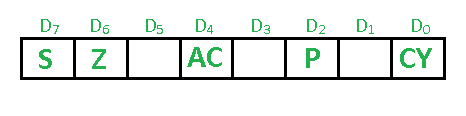

# 8085 微处理器中的标志寄存器

> 原文:[https://www . geesforgeks . org/flag-register-8085-微处理器/](https://www.geeksforgeeks.org/flag-register-8085-microprocessor/)

先决条件–8085 微处理器
的[寄存器**标志寄存器**是专用寄存器。根据任何算术和逻辑运算后的结果值，标志位变为置位(1)或复位(0)。在 8085 微处理器中，标志寄存器由 8 位组成，其中只有 5 位是有用的。](https://www.geeksforgeeks.org/registers-8085-microprocessor/)

这 5 个标志是:

1.  **符号标志(S)–**任何操作后，如果结果的 MSB (B(7))为 1，则表示数字为负，符号标志变为置位，即 1。如果 MSB 为 0，则表示数字为正，符号标志变为复位，即 0。
    从 00H 到 7F，标志为 0
    从 80H 到 FF，标志为 1

1- MSB 为 1(负)
0- MSB 为 0(正)

**示例:**

MVI A 30(在寄存器 A 中加载 30H)
MVI b40(在寄存器 B 中加载 40H)
SUB B(A = A–B)
这组指令将符号标志设置为 1，因为 30–40 是负数。

MVI A 40(在寄存器 A 中加载 40H)
MVI b30(在寄存器 B 中加载 30H)
SUB B(A = A–B)
这组指令将符号标志重置为 0，因为 40–30 是正数。

*   **Zero Flag (Z) –** After any arithmetical or logical operation if the result is 0 (00)H, the zero flag becomes set i.e. 1, otherwise it becomes reset i.e. 0.
    00H zero flag is 1.
    from 01H to FFH zero flag is 0

    1-零结果
    0-非零结果

    **示例:**

    MVI A 10(在寄存器 A 中加载 10H)
    SUB A(A = A–A)
    这组指令将把零标志设置为 1，因为 10H–10H 是 00H

    *   **Auxiliary Carry Flag (AC) –** This flag is used in BCD number system(0-9). If after any arithmetic or logical operation D(3) generates any carry and passes on to B(4) this flag becomes set i.e. 1, otherwise it becomes reset i.e. 0\. This is the only flag register which is not accessible by the programmer

    1-加法时从位 3 执行或减法时借用到位 3
    0-否则

    **示例:**

    MOV A 2B(在寄存器 A 中加载 2BH)
    MOV b39(在寄存器 B 中加载 39H)
    ADD B(A = A+B)
    这组指令将辅助进位标志设置为 1，与添加 2B 和 39 一样，添加较低阶的半字节 B 和 9 将生成进位。

    *   **Parity Flag (P) –** If after any arithmetic or logical operation the result has even parity, an even number of 1 bits, the parity register becomes set i.e. 1, otherwise it becomes reset i.e. 0.

    1-累加器有偶数个 1 位
    0-累加器有奇数个奇偶校验

    **示例:**

    MVI A 05(加载寄存器 A 中的 05H)
    该指令将奇偶校验标志设置为 1，因为 05H 的 BCD 码是 0000101，它包含偶数个 1，即 2。

    *   **Carry Flag (CY) –** Carry is generated when performing n bit operations and the result is more than n bits, then this flag becomes set i.e. 1, otherwise it becomes reset i.e. 0.
    During subtraction (A-B), if A>B it becomes reset and if (A<B) it becomes set.
    Carry flag is also called borrow flag.

    1-加法时从 MSB 位执行或减法时借用到 MSB 位
    0-不执行或借用到 MSB 位

    **示例:**

    MVI A 30(在寄存器 A 中加载 30H)
    MVI b40(在寄存器 B 中加载 40H)
    SUB B(A = A–B)
    这组指令将进位标志设置为 1，因为 30–40 产生进位/借位。

    MVI A 40(在寄存器 A 中加载 40H)
    MVI b30(在寄存器 B 中加载 30H)
    SUB B(A = A–B)
    这组指令将符号标志重置为 0，因为 40–30 不产生任何进位/借位。